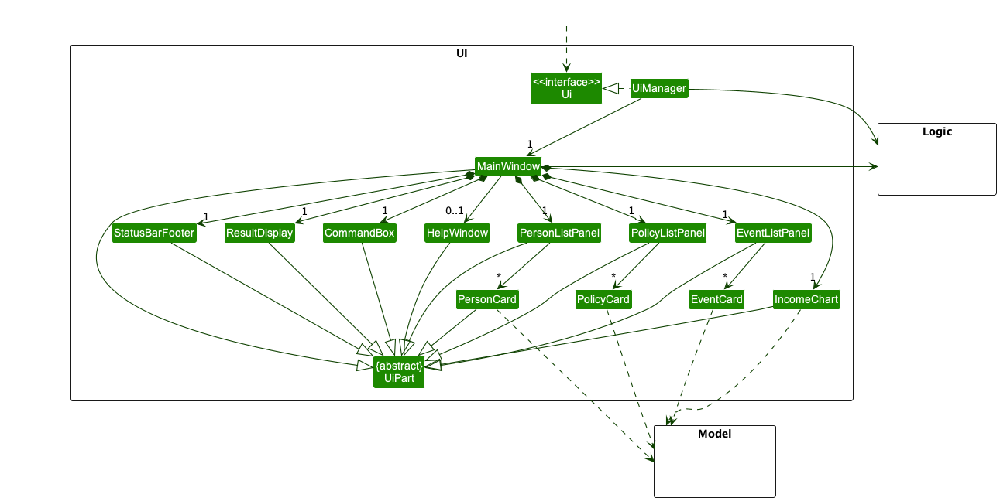
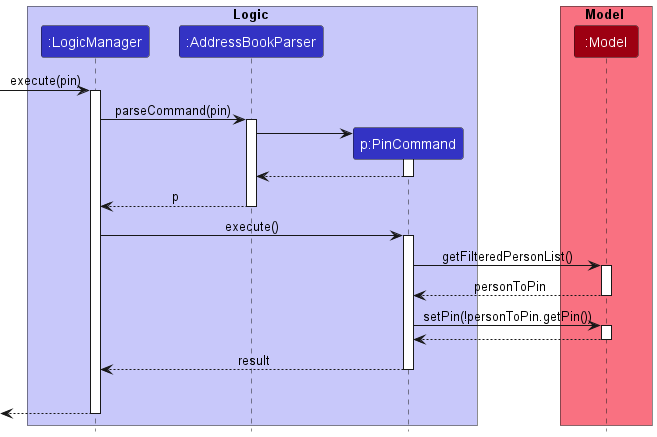
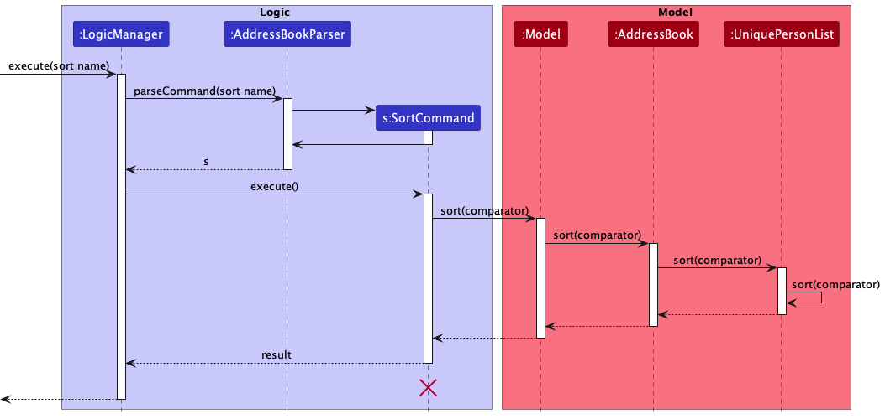
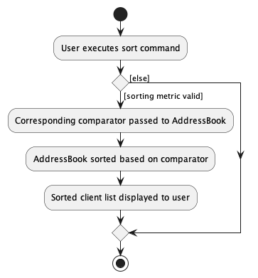
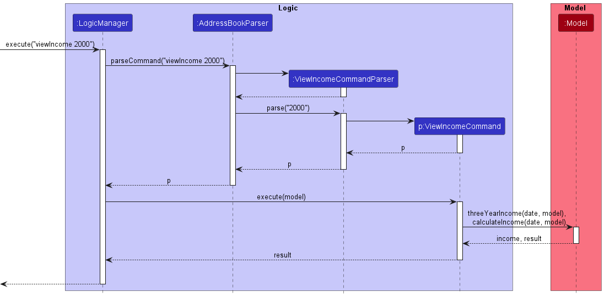
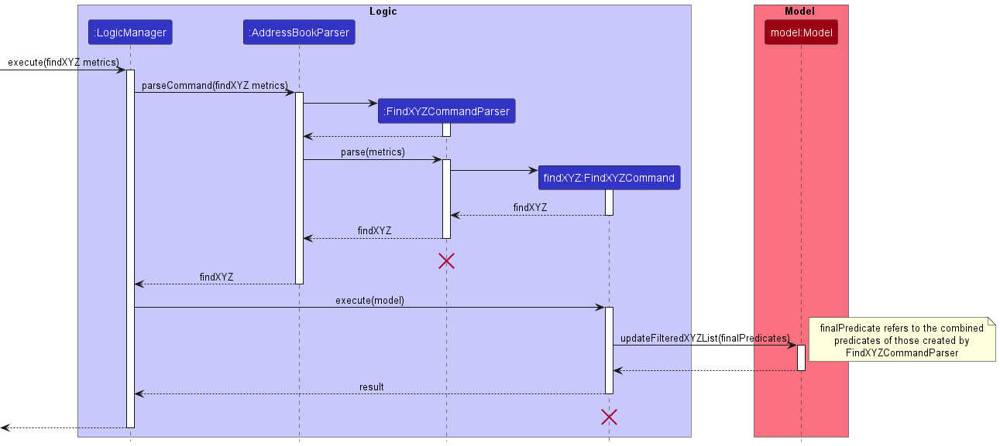
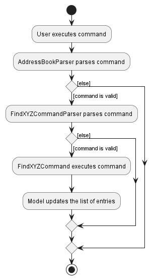

* Table of Contents
{:toc}

--------------------------------------------------------------------------------------------------------------------

## **Acknowledgements**

* {list here sources of all reused/adapted ideas, code, documentation, and third-party libraries -- include links to the original source as well}

--------------------------------------------------------------------------------------------------------------------

## **Setting up, getting started**

Refer to the guide [_Setting up and getting started_](SettingUp.md).

--------------------------------------------------------------------------------------------------------------------

# **Design**

:bulb: **Tip:** The `.puml` files used to create diagrams in this document can be found in the [diagrams](https://github.com/AY2223S1-CS2103T-W13-2/tp/tree/master/docs/diagrams) folder. Refer to the [PlantUML Tutorial at se-edu/guides](https://se-education.org/guides/tutorials/plantUml.html) to learn how to create and edit diagrams.

### Architecture

The ***Architecture Diagram*** given above explains the high-level design of the App.

Given below is a quick overview of main components and how they interact with each other.

**Main components of the architecture**

**`Main`** has two classes called [`Main`](https://github.com/AY2223S1-CS2103T-W13-2/tp/blob/master/src/main/java/longtimenosee/Main.java) and [`MainApp`](https://github.com/AY2223S1-CS2103T-W13-2/tp/blob/master/src/main/java/longtimenosee/MainApp.java). It is responsible for,
* At app launch: Initializes the components in the correct sequence, and connects them up with each other.
* At shut down: Shuts down the components and invokes cleanup methods where necessary.

[**`Commons`**](#common-classes) represents a collection of classes used by multiple other components.

The rest of the App consists of four components.

* [**`UI`**](#ui-component): The UI of the App.
* [**`Logic`**](#logic-component): The command executor.
* [**`Model`**](#model-component): Holds the data of the App in memory.
* [**`Storage`**](#storage-component): Reads data from, and writes data to, the hard disk.

**How the architecture components interact with each other**

The *Sequence Diagram* below shows how the components interact with each other for the scenario where the user issues the command `delete 1`.

Each of the four main components (also shown in the diagram above),

* defines its *API* in an `interface` with the same name as the Component.
* implements its functionality using a concrete `{Component Name}Manager` class (which follows the corresponding API `interface` mentioned in the previous point.)

For example, the `Logic` component defines its API in the `Logic.java` interface and implements its functionality using the `LogicManager.java` class which follows the `Logic` interface. Other components interact with a given component through its interface rather than the concrete class (reason: to prevent outside component's being coupled to the implementation of a component), as illustrated in the (partial) class diagram below.

The sections below give more details of each component.

### UI component

The **API** of this component is specified in [`Ui.java`](https://github.com/AY2223S1-CS2103T-W13-2/tp/blob/master/src/main/java/longtimenosee/ui/Ui.java) and it's class diagram is shown below

The UI consists of a `MainWindow` that is made up of parts e.g.`CommandBox`, `ResultDisplay`, `PersonListPanel`, `EventListPanel`, `PolicyListPanel`, `StatusBarFooter` etc. All these, including the `MainWindow`, inherit from the abstract `UiPart` class which captures the commonalities between classes that represent parts of the visible GUI.

The `UI` component uses the JavaFx UI framework. The layout of these UI parts are defined in matching `.fxml` files that are in the `src/main/resources/view` folder. For example, the layout of the [`MainWindow`](https://github.com/AY2223S1-CS2103T-W13-2/tp/blob/master/src/main/java/longtimenosee/ui/MainWindow.java) is specified in [`MainWindow.fxml`](https://github.com/AY2223S1-CS2103T-W13-2/tp/blob/master/src/main/resources/view/MainWindow.fxml)

Similarly, the layout of [`PersonListPanel`](https://github.com/AY2223S1-CS2103T-W13-2/tp/blob/master/src/main/java/longtimenosee/ui/PersonListPanel.java), [`PolicyListPanel`](https://github.com/AY2223S1-CS2103T-W13-2/tp/blob/master/src/main/java/longtimenosee/ui/PolicyListPanel.java) and [`EventListPanel`](https://github.com/AY2223S1-CS2103T-W13-2/tp/blob/master/src/main/java/longtimenosee/ui/EventListPanel.java) are all specified in their respective [`.fxml`](https://github.com/AY2223S1-CS2103T-W13-2/tp/tree/master/src/main/resources/view) files.

The layout of [`IncomeGraph`](https://github.com/AY2223S1-CS2103T-W13-2/tp/blob/master/src/main/java/longtimenosee/ui/IncomeGraph.java) is specified in [`LineGraph.fxml`](https://github.com/AY2223S1-CS2103T-W13-2/tp/blob/master/src/main/resources/view/LineGraph.fxml)

The `UI` component,

* executes user commands using the `Logic` component.
* listens for changes to `Model` data so that the UI can be updated with the modified data.
* keeps a reference to the `Logic` component, because the `UI` relies on the `Logic` to execute commands.
* depends on some classes in the `Model`, `Policy` and `Event` component, as it displays `Person`, `Policy` and `Event` objects residing in the `Model`.

### Logic component

The **API** of this component is specified in [`Logic.java`](https://github.com/AY2223S1-CS2103T-W13-2/tp/blob/master/src/main/java/longtimenosee/logic/Logic.java) and it's (partial) class diagram is shown below

How the `Logic` component works:
1. When `Logic` is called upon to execute a command, it uses the `AddressBookParser` class to parse the user command.
1. This results in a `Command` object (more precisely, an object of one of its subclasses e.g., `AddCommand`) which is executed by the `LogicManager`.
1. The command can communicate with the `Model` when it is executed (e.g. to add a person).
1. The result of the command execution is encapsulated as a `CommandResult` object which is returned back from `Logic`.

The Sequence Diagram below illustrates the interactions within the `Logic` component for the `execute("delete 1")` API call.

:information_source: **Note:** The lifeline for `DeleteCommandParser` should end at the destroy marker (X) but due to a limitation of PlantUML, the lifeline reaches the end of diagram.

Here are the other classes in `Logic` (omitted from the class diagram above) that are used for parsing a user command:

How the parsing works:
* When called upon to parse a user command, the `AddressBookParser` class creates an `XYZCommandParser` (`XYZ` is a placeholder for the specific command name e.g., `AddCommandParser`) which uses the other classes shown above to parse the user command and create a `XYZCommand` object (e.g., `AddCommand`) which the `AddressBookParser` returns back as a `Command` object.
* All `XYZCommandParser` classes (e.g., `AddCommandParser`, `DeleteCommandParser`, ...) inherit from the `Parser` interface so that they can be treated similarly where possible e.g, during testing.

### Model component

The **API** of this component is specified in [`Model.java`](https://github.com/AY2223S1-CS2103T-W13-2/tp/blob/master/src/main/java/longtimenosee/model/Model.java) and its class diagram is shown below

The `Model` component,

* stores the following data
  * all `Person` objects (which are contained in a `UniquePersonList` object)
  * all `Policy` objects (which are contained in a `UniquePolicyList` object)
  * all `Event` objects (which are contained in a `UniqueEventList` object)

  

  

* stores the currently 'selected' `XYZ` objects (e.g., results of a search query) as a separate _filtered_ list which is exposed to outsiders as an unmodifiable `ObservableList<XYZ>` that can be 'observed' e.g. the UI can be bound to this list so that the UI automatically updates when the data in the list change.
* stores a `UserPref` object that represents the user’s preferences. This is exposed to the outside as a `ReadOnlyUserPref` objects.
* does not depend on any of the other three components (as the `Model` represents data entities of the domain, they should make sense on their own without depending on other components)

:information_source: **Note:** `XYZ` here refers to either Person, Policy or Event

### Storage component

The **API** of this component is specified in [`Storage.java`](https://github.com/AY2223S1-CS2103T-W13-2/tp/blob/master/src/main/java/longtimenosee/storage/Storage.java) and its class diagram is shown below

The `Storage` component,
* can save both app data and user preference data in json format, and read them back into corresponding objects.
* inherits from both `AddressBookStorage` and `UserPrefStorage`, which means it can be treated as either one (if only the functionality of only one is needed).
* depends on some classes in the `Model` component (because the `Storage` component's job is to save/retrieve objects that belong to the `Model`)

### Common classes

Classes used by multiple components are in the `longtimenosee.commons` package.

--------------------------------------------------------------------------------------------------------------------

# **Feature Implementation**

This section describes some noteworthy details on how certain features are implemented.

## Client features
### pin and viewPin feature

#### Implementation

Each person object has a boolean attribute known as pinned. When the user pins the person using the index. This attribute will be set to true. When the user pins that same person again, this attribute will be set to false.

* `pin <Index>` — Sets the boolean pinned attribute to a value of true.
* `pin <Index>` — If the boolean pinned attribute was previously set true, calling the command again will set it to false.
* `viewPin` — Uses the predicate PinnedPersonPredicate to sort the full list of existing clients to display only clients with pinned attribute of true.

The following sequence diagram summarizes how pin works:

The following activity diagram summarizes what happens when a user executes a new command:

Pin activity diagram:   

View pin activity diagram:   

#### Design considerations

**Aspect: How pin and viewPin executes:**

* **Alternative 1 (current choice):** Uses a predicate to sort through pinned clients.
    * Pros: Easy to implement.
    * Cons: Hard for additional extensions given that this method uses a boolean attribute.

* **Alternative 2:** Saves the entire list of clients pinned.
  * Pros: More potential for further extensions.
  * Cons: May result in performance issues in terms of memory usage.
  
### Sort Feature

#### Implementation

The Sort mechanism is facilitated by `UniquePersonList`, which utilizes Java's `ObservableList` library to store the client list.

The method `FXCollections.sort()` is called by UniquePersonList, which takes in a comparator as an argument and sorts the client list based on the comparator supplied.
Each attribute of a client which is considered a valid sorting metric has its own comparator within its class.

This operation is exposed in the `Model` interface as `Model#sort()`.

Given below is an example usage scenario and how the `Sort` mechanism behaves at each step.

Step 1.  The user executes `list` to view his current client list.

Step 2. The user executes `sort income` to view his client list by ascending income levels. This will pass the income comparator to `Model#sort()`. The list will be sorted and changes can be viewed immediately.

The following sequence diagram shows how the sort operation works:

The following activity diagram summarizes what happens when a user issues a `sort` command:

#### Design Considerations

**Aspect: How to manage saving changes to `Storage`**

As any commands called which modifies the `AddressBook` will save these changes to storage, a major design consideration was whether to save these post-sort changes to the storage

* **Alternative 1 (current choice):** save the changes as per normal but provide an option to return to the default sorting view
  * Pros: Easy to implement, less memory required to keep separate original list 
  * Cons: Client list remains in a particular order after `sort` command is called until `sort default` is issued

* **Alternative 2:** keep original list and sorted list as 2 separate lists 
  * Pros: User need not call further command to view original list
  * Cons: More memory to store 2nd list, more difficult to implement 

**Aspect: How to sort list given different metrics** 

* **Alternative 1 (current choice):** each sortable class has its own comparator and will be passed as an argument after `sort` command is parsed
  * Pros: Better abstraction and Better OOP 
  * Cons: Comparators must be written for every class  

* **Alternative 2:** `Model` decides how to sort the client list based on sort metric called 
  * Pros: Easier to implement 
  * Cons: less abstraction; information about client attributes will have to be unnecessarily exposed to `Model` class 

## Policy Features

### Assigning clients a policy

#### Implementation

Users can assign existing policies to a client, whilst providing uptake details
such as the premium amount and start/end dates. This is facilitated by the `PolicyAssignCommand` class
and `PolicyAssignCommandParser` classes.

The `PolicyAssignCommandParser` parses the input from the user and identifies which policy has to be assigned to
which client. The appropriate AssignedPolicy object is created with details given in the input 
and is then assigned to the respective client in `PolicyAssignCommand`.

* `Person#addPolicy(assignedPolicy)` - Attempts to add an assigned policy to a set of assigned policies stored within
the person object. It also returns a boolean describing if the assigned policy already exists in the set.

Given below is an example usage scenario and how an `assign` command is executed.

The interactions between the components during the usage scenario is shown in the *Sequence Diagram* below.
The use of `command_details` serves to substitute the command `"assign 1 1 pr/200 sd/2020-10-12 ed/2022-10-12"` for readability. 

  

The following activity diagram summarizes what happens when a user executes a new command:

Step 1: The user enters `parse(assign 1 1 pr/200 sd/2020-10-12 ed/2022-10-12)` command to assign the first policy
to the first person. The policy has a yearly premium of $200 and lasts for 2 years, from 2020 to 2022.

Step 2: The `PolicyAssignCommandParser` parses the input and confirm that the indices are valid. 
A `PolicyAssignCommand` object with all parameters is constructed. 

:information_source: **Note:** 
Policy and Person indices that are not found in the `UniquePersonList` and `UniquePolicyList` respectively
would be regarded as invalid indices. 

Step 3: The `PolicyAssignCommand` is executed. The corresponding policy and person objects are retrieved and  
if not already assigned, the policy is assigned to the person.

#### Design considerations

**Aspect: Whether to allow users to assign policies to persons using names:**

* **Alternative 1:** Allows assignment using policy/persons names.
  * Pros: More flexible and quicker assigning if user knows exactly who and which policy they want to assign.
  * Cons: More-bug prone, and would require the user to accurately provide the exact name of the policy/person. 
  Hard to get used to for new users, and complicated for established users with lots of clients and policies.

* **Alternative 2: (Current implementation)** Allow assignment using policy/person indices.
  * Pros: Easy to implement and avoids confusion for new users.
  * Cons: Would require the user to check out the list and find out the indices of their target person/policy.
  This is overcome by the functionality of the `find` command, which allows users to filter the lists for specific 
  persons/policies.

### viewIncome feature

#### Implementation

This feature builds on the new policy class created. Where each client has a set of policies assigned to them. In this case, a financial advisor’s income is treated as a class by itself. Where inside the class there are methods of retrieving the income based on different factors stated below.

The main calculation done in class FinancialAdvisorIncome is a function called calculateIncome. This function iterates through a list of clients and for each client, it iterates through the list of policies they have. For each of the policies, LocalDate and Period are used to determine which commission (out of the 3 year differing rates) the assigned policy of the current person is in. Subsequently, all commissions are multiplied by policy premium with the duration of the policy (relative from start date to given date) and summed to give income for a particular year.

* `viewIncome YEAR` — Invokes the calculation of user's three year income with `YEAR` as the first year via the function .

The following sequence diagram summarizes how viewIncome works:

The following activity diagram summarizes what happens when a user executes a new command:

View income activity diagram:   

#### Design considerations

**Aspect: How viewIncome executes:**

* **Alternative 1 (current choice):** Encapsulate user's income into a class of its own
    * Pros: By assigning FinancialAdvisorIncome as a class, we are able to add an additional layer of abstraction to deriving the financial advisors income. By doing so, it is easier to utilize the income for other features.
    * Cons: Might pose a problem for retrival of values from class.

* **Alternative 2:** Saves the entire list of clients pinned.
    * Pros: More potential for further extensions.
    * Cons: May result in performance issues in terms of memory usage.

## Event Features

### AddEvent Feature

#### Proposed Implementation
The proposed `AddEvent` feature is facilitated by the `AddressBook` Model. The `AddressBook` contains information on the list of people and the current events available (i.e: `UniqueEventList` and `UniquePersonList`). The `AddEventParser`  serves as an additional <i>abstraction of logic</i> to determine the validity of an Event on the following conditions, and throws an appropriate exception based on the following conditions.

* Valid Client Name : An event is tagged to a single Client. The Client’s name must already exist in the `UniqueEventList`. If said person specified does not exist, the `AddEventParser` throws an: `InvalidPersonException`

* No overlapping events: . If the event overlaps with another event (i.e: occurs on the same day, and has a start and end time that coincides with another event in `UniqueEventList`, the `AddEventParser` throws an: `OverlapEventException`.)

Given below is an example usage scenario and how the `AddEventCommand` behaves at each step.

<B>Step 1</B>. The user launches the application for the first time. The` AddressBook` model is initialized with both the appropriate `UniquePersonList` and `UniqueEventList`. The lists are empty, with a person named `John Williams`.

<B>Step 2</B>. The user adds an event `newEvent desc Star Wars Soundtrack  pName John Williams, date/2020-01-01, start/12:00 end/13:00`. The event is added successfully.

<B>Step 3</B>. The user then adds a new event `newEvent desc JurassicWorld Soundtrack  pName John Williams, date/2020-01-01, start/12:30 end/13:00`. This time window of this event overlaps with the previously event, and the Event List is no longer updated. An `OverlapEventException` is thrown by the parser.

The following activity diagram summarizes how an `AddEventCommand` is parsed at each step.

  

#### Design considerations

**Aspect: Encapsulation of client vs event:**

* **Alternative 1 (current choice):** Event class is a stand-alone class with reference to a Client
    * Pros: Object-Oriented Programming approach, easier to implement, more scalable in handling Event features

* **Alternative 2:** An event becomes an attribute of Client 
    * Pros: Also an intuitive Object-Oriented Programming approach
    * Cons: Difficult and less efficient to implement Event features such as searching

## General Features
### Find feature

#### Implementation

Note: `XYZ` here refers to either Client, Policy or Event

The `findXYZ` mechanism is facilitated by `FilteredList` from JavaFx, by using `FilteredList#setPredicate()` to update the list of XYZ being displayed based on the specified metrics.

Given below is an example usage scenario and how the `findXYZ` mechanism behaves at each step.

Step 1. The user executes a `findXYZ` command to find any clients matching the given metrics. The `findXYZ` command calls `AddressBookParser#parseCommand()`, which parses the arguments and calls `FindXYZCommandParser#parse()` with the obtained results

Step 2. `FindXYZCommandParser#parse()` goes through the arguments and check which prefixes are present and creates a `FindXYZCommand` object with the corresponding predicates.

:information_source: **Note:** If the arguments to the command is invalid, the execution will stop by this step.

Step 3. `LogicManager` executes the `FindXYZCommand` using the combined predicates, which calls `Model#updateFilteredXYZList()` and updates the list of XYZ displayed

The following sequence diagram shows how the findXYZ operation works:

:information_source: **Note:** The lifeline for `FindXYZCommandParser` and `FindXYZCommand` should end at the destroy marker (X) but due to a limitation of PlantUML, the lifeline reaches the end of diagram.

The following activity diagram summarizes what happens when a user executes a findXYZ command:

#### Design considerations

**Aspect: How `findXYZ` executes:**

* **Alternative 1 (current choice):** Utilise predicates and test for each predicate against each contact in the LTNS by making use of `FilteredList`
    * Pros: 
      * Easy extension for additional predicates, by adding predicate classes
      * Lesser user implementation
    * Cons: 
      * If there are too many predicates, there could be an excessive number of classes to manage
      * Lesser control over lower level details of predicate testing

* **Alternative 2:** Take in user defined conditions and test for each person in the LTNS
    * Pros: 
      * More control over lower level details.
      * More efficient algorithms can be used for searching which can improve the overall runtime
    * Cons: 
      * Testing required to ensure that the predicate testing algorithms are implemented correctly
      * Larger overhead in writing code

Alternative 1 was preferred over alternative 2 due to the following reasons:
  * We could make use of `FilteredList` and reduce the amount of additional code that is required.
  * In addition, there is also a greater guarantee on the correctness of the code as compared to if we were to implement our own algorithms
  * Lesser testing overhead, which meant that we can focus more testing on the features implementation and reduce more potential bugs

--------------------------------------------------------------------------------------------------------------------

# **Documentation, logging, testing, configuration, dev-ops**

* [Documentation guide](Documentation.md)
* [Testing guide](Testing.md)
* [Logging guide](Logging.md)
* [Configuration guide](Configuration.md)
* [DevOps guide](DevOps.md)

--------------------------------------------------------------------------------------------------------------------

## **Appendix: Requirements**

### Product scope

**Target user profile**:

* has a need to manage a significant number of clients
* is a financial advisor
* has a  need to store additional client-related information
* prefer desktop apps over other types
* can type fast
* prefers typing to mouse interactions
* is reasonably comfortable using CLI apps

**Value proposition**: manage clients faster than a typical mouse/GUI driven app

### User stories

Priorities: High (must have) - `***`, Medium (nice to have) - `**`, Low (unlikely to have) - `*`

| Priority | As a …​                                   | I want to …​                      | So that I can…​                                                       |
|----------|-------------------------------------------|-----------------------------------|-----------------------------------------------------------------------|
| `***`    | new user                                  | see usage instructions            | refer to instructions when I forget how to use the App                |
| `***`    | user                                      | add a new person                  |                                                                       |
| `***`    | user                                      | delete a person                   | remove entries that I no longer need                                  |
| `***`    | user                                      | find a person by name             | locate details of persons without having to go through the entire list |
| `**`     | user                                      | hide private contact details      | minimize chance of someone else seeing them by accident               |
| `*`      | user with many persons in my contact list | sort persons by name              | locate a person easily                                                |
| `**`     | new user                                  | see sample data                   | Have a better understanding of the app's default layout               |
| `**`     | user                                      | filter my clients by keywords     | Locate my clients easily, based on a particular critera               |
| `**`     | user                                      | update my client list             | Edit their contact details                                            |
| `*`      | user                                      | have a reliable method            | store contact information without losing data                         |
| `*`      | user                                      | view individual client's profiles | keep track of multiple, unique clients                                |
| `*`      | user                                      | pin important clients             | be reminded of users which are of higher priority                     |
| `*`      | user                                      | add an event                      |                                                                       |
| `*`      | user                                      | delete an event                   | remove events that I no longer need to keep track of                  |
| `**`     | user                                      | view my upcoming events           | be reminded of my upcoming events for the week                        |

### Use cases

(For all use cases below, the **System** is `LongTimeNoSee (LTNS)` and the **Actor** is the `user`, unless specified otherwise)

**General Use Cases**

**Use case 1: Help**

**MSS**

1. User is not sure what commands there are
2. User inputs the command to request help
3. LTNS displays a help message

   Use case ends

**Client related Use Cases**

**Use Case 2: Add client**

**MSS**

1. User loads the application
2. User inputs the command to add a client
3. User tags on the details he would like to specify
4. LTNS switches to the default view automatically
5. LTNS adds the latest client to the list view

   Use case ends

**Use case 3: Viewing all clients**

**MSS**

1. User requests to view all clients.
2. LTNS displays a list of all clients

   Use case ends

**Use case 4: View currently filtered clients**

**MSS**

1. User requests to view a list of all currently filtered clients 
2. LTNS displays a list of currently filtered clients

   Use case ends.

**Use case 5: Delete a person**

**MSS**

1. User requests to <u>view all clients(UC3)</u>
2. User requests to delete a specific person in the list
3. LTNS deletes the person

   Use case ends

**Extensions**

* 2a. The list is empty.

  Use case ends.

* 3a. The given index is invalid.

    * 3a1. LTNS shows an error message.

      Use case resumes at step 2.
    
**Use case 6: Sort a list**

**MSS**

1. User requests to <u>view all clients(UC3)</u>, which will be shown based on date added (default sort)
2. User requests to sort the list based on name (or any other metric)
3. LTNS shows the list of clients, sorted in alphabetical order based on client's name. (or based on how the metric is compared)

   Use case ends

**Extensions**

* 2a. Given sorting metric does not exist.

  Use case ends.

**Use case 7: Delete a person**

**MSS**

1. User requests to <u>list all clients(UC3)</u>
2. User requests to delete a specific person in the list
3. LTNS deletes the person

   Use case ends

**Extensions**

* 2a. The list is empty.

  Use case ends.

* 3a. The given index is invalid.

    * 3a1. LTNS shows an error message.

      Use case resumes at step 2.

**Use case 8: Pin a client**

**MSS**

1. User requests to pin a client by name
2. LTNS will display the pinned clients
3. User will be able to see all pinned clients in all pages.
    
   Use case ends

**Use case 9: Find a client/policy/event**

**MSS**

1. User requests to search by a certain metric.
2. LTNS shows a list of clients/policies/events with matching metrics.

   Use case ends

**Extensions**

* 2a. User requests another search.

  * 2a1. LTNS displays a new list of clients with matching metrics.

    Use case ends.

**Policy related Use Cases**

**Use Case 10: Add Policy** 

**MSS**

1. User loads the application
2. User inputs the command to add a policy
3. User tags on the details he would like to specify
4. LTNS switches to the default policy view automatically
5. LTNS adds the latest policy to the list policy view

    Use Case ends

**Extensions**

* 3a. User attempts to add a Policy which already exists 
  * 3a1. LTNS displays en error message.
  
    Use Case resumes at Step 2

**Use Case 11: Assign Policy**

**MSS**

1. Use loads the application
2. User inputs the command to assign a existing policy to an existing client
3. User tags on the details he would like to specify 
4. LTNS switches to the default client view automatically 
5. LTNS assigns the specified policy to the specified client
    
    Use Case ends

**Extensions**
* 3a. User inputs an invalid index when specifying the policy 
    * 3a.1 LTNS displays an error message.
      
        Use Case resumes at Step 2

* 3b. User inputs an invalid index when specifying the client
    * 3b.1 LTNS displays an error message.

      Use Case resumes at Step 2

**Use Case 12: Viewing all policies**

**MSS**

1. User requests to view all policies.
2. LTNS displays a list of all policies

   Use case ends

**Use case 13: View currently filtered policies**

**MSS**

1. User requests to view a list of all currently filtered policies
2. LTNS displays a list of currently filtered policies

   Use case ends.

**Use Case 14: Deleting a policy**

**MSS**

1. User requests to <u>list all policies(UC12)</u>
2. User requests to delete a specific policy in the list
3. LTNS deletes the policy

   Use case ends

**Extensions**

* 2a. The list is empty.

  Use case ends.

* 3a. The given index is invalid.

    * 3a1. LTNS shows an error message.

      Use case resumes at step 2.

**Event related Use Cases**

**Use Case 15: Add Event**

**MSS**

1. User loads the application
2. User inputs the command to add an event
3. User tags on the event details he would like to specify
4. LTNS adds the latest event to list of events.
5. LTNS switches to the default event view automatically

   Use case ends

**Extensions**
* 4a. The event specified overlaps with another event
  * 4a1. LTNS displays an error message 

    Use Case resumes at Step 3.
  

* 4b. The event specifies a client that doesn't exist in LTNS 
    * 4b1. LTNS displays an error message

    Use Case resumes at Step 3.

**Use case 16: Delete an event**

**MSS**

1. User requests to <u>view all events(UC 17)</u>
2. User requests to delete a specific event in the list
3. LTNS deletes the event

   Use case ends

**Extensions**

* 2a. The event list is empty.

  Use Case ends.

* 3a. The given index is invalid.

    * 3a1. LTNS shows an error message.

      Use Case resumes at step 2.

**Use case 17: View all events**

**MSS**

1. User requests to view all events
2. LTNS displays a list of all events

   Use Case ends

**Use case 18: View currently filtered events**

**MSS**

1. User requests to view all currently filtered events 
2. LTNS displays a list of all currently filtered events.

    Use Case ends

**Use case 19: View Calendar**

**MSS**

1. User requests to view his calendar 
2. LTNS displays a list of all events in his calendar 
    
    Use Case ends

### Non-Functional Requirements

1.  Should work on any _mainstream OS_ as long as it has Java `11` or above installed.
2.  _mainstream OS_ includes Windows, MacOS, Linux systems with 64-bit machines
3.  Should be able to hold up to 1000 persons without a noticeable sluggishness in performance for typical usage.
4.  A user with above average typing speed for regular English text (i.e. not code, not system admin commands) should be able to accomplish most of the tasks faster using commands than using the mouse.
5.  Size of windows should be scalable to full screen for maximum screen utilization
6. Performance requirements: Should be able to serve its features right now
8. Extremely intuitive and minimalistic design to avoid confusion. 
9. The product is not required to handle the direct contacting of users.
10. For added personality, user should be able to have some customisability.(e.g: Change UI’s theme based on system-defined presets)

### Glossary

* **Mainstream OS**: Windows, Linux, Unix, OS-X
* **Client**: A client is a person being served by the financial advisor.
* **Policy**: An investment or insurance policy that is being sold by an insurance company, through the financial advisor.
* **Financial advisor**: A professional paid to offer financial advice to clients
* **Event**: Any event or appointment that involves a client in the client list 
* **Risk Appetite**: Level of risk a client is willing to accept or tolerate when making financial decisions

--------------------------------------------------------------------------------------------------------------------

# **Appendix**

## **Instructions for manual testing**

Given below are instructions to test the app manually.

:information_source: **Note:** These instructions only provide a starting point for testers to work on;
testers are expected to do more *exploratory* testing.

### Launch and shutdown

1. Initial launch

   1. Download the jar file and copy into an empty folder

   1. Double-click the jar file Expected: Shows the GUI with a set of sample clients. The window size may not be optimum.

1. Saving window preferences

   1. Resize the window to an optimum size. Move the window to a different location. Close the window.

   1. Re-launch the app by double-clicking the jar file. 
       Expected: The most recent window size and location is retained.

1. _{ more test cases …​ }_

### Testing client functions

#### Adding a client
1. Adding a Client
   1. Prerequisites: None
   2. Test case: `addClient n/Clement Tan p/98765432 e/clementTan@example.com a/311, Clementi Ave 2, #02-25 t/friends t/owesMoney b/2019-05-05 i/10000.00 ra/M`  
      Expected: Adds a client named `Clement Tan`, switches to the client display.
   3. Test case: `addClient n/Jaron Tan p/9111111 e/JaronTan@example.com a/311, Clementi Ave 2, #02-25 t/friends b/2019-05-05 i/10000.00 ra/M`  
      Suppose a client with the name `Jaron Tan` already exists in the LTNS.
      Expected: An error message for a duplicate client should be displayed.
   

#### Deleting a client 
1. Deleting a client
    1. Prerequisites: Client list is not empty 
    2. Test Case: `deleteClient 1`  
       Expected: Deletes the first client on the currently filtered clients list
   3.  Test Case: `deleteClient 300`  
       Suppose there is no client at index 300
   
       Expected: An error message for invalid client index should be displayed
   
#### Editing a client 
1. Editing a client 
   1. Prerequisites: Client list is not empty
   2. Test Case: `editClient 1 n/Bob`  
      Expected: Edits the client with an index of 1 to a new name `Bob`.
   3. Test Case: `editClient 300 t/InvalidIndex`  
      Suppose there is no client at index 300

      Expected: An error message for invalid client index should be displayed

#### Switching to the client view
1. Switching to the client view
    1. Prerequisites: None
    2. Test case: `clients`  
       Expected: Client view is shown, list of currently filtered clients is displayed.

#### Listing all clients
1. Listing all clients
    1. Prerequisites: The current client list should be filtered.
    2. Test case: `allClients`  
       Expected: All clients stored in LTNS are displayed.

#### Pinning a client
1. Pinning a new client
   1. Prerequisites: List of clients is not empty, currently viewing list of clients
   2. Test case: `pin 1`  
      Expected: Pinned client message shown to user in status message. 
   3. Test case: `pin 3`  
      Suppose that there is no client in index 3  
      Expected: An error message for invalid client index should be displayed.

#### Sorting the client list 
1. Sorting the client list 
   1. Prerequisites: List of clients is not empty, currently viewing list of clients. Client names do not contain numbers.
   2. Test case: `sort name`
      Expected: Sort client message shown to user in status message, client list sorted in alphabetical order
   3. Test case: `sort risk appetite`
      Expected: Sort client message shown to user in status message, client list sorted by Risk Appetite from high to low
   4. Test case: `sort address`
      Expected: An error message indicating that the sorting metric does not exist should be displayed 

#### Searching for a client
1. Searching for a client
   1. Prerequisites: List of clients is not empty
   2. Test case: `findClient n/Alex t/friends`
      Suppose that there is a client named `Alex` and tagged with the `friends` tag in LTNS
      Expected: Message indicating the number of clients found is displayed and client details of `Alex` is shown
   3. Test case: `findClient n/jeffrey`
      Suppose that there is no client named `Jeffrey` in LTNS
      Expected: Message indicating that no clients were found is displayed

### Testing policy functions

#### Adding a policy
1. Adding a new policy
   1. Prerequisites: None
   2. Test case: `addPolicy ti/PruShield cmp/AIA cms/10% 5% 1% cov/LIFE`  
      Expected: Policy is added, screen switches to the policies display.
   3. Test case: `addPolicy ti/PruShield cmp/AIA cms/10% 5% 1% cov/LIFE`  
      Expected: Policy "already added" message shown to user in status message.
   4. Other incorrect `addPolicy` commands to try: `addPolicy`, `addPolicy ti/p` (or any other field left blank)

#### Deleting a policy
   1. Deleting a policy
      1. Prerequisites: Current displayed policy list has to be non-empty
      2. Test case: `deletePolicy 1` 
         Expected: Policy is deleted, list of updated policies is displayed.
      3. Test case: `deletePolicy 0` 
         Expected: No policy is deleted. Error details shown in the status message.
      4. Other incorrect `deletePolicy` commands to try: `deletePolicy`, `deletePolicy x` (where x is larger than the list size)

#### Switching to the policy view
   1. Switching to the policy view
      1. Prerequisites: None
      2. Test case: `policies`  
         Expected: Policy view is shown, list of currently filtered policies is displayed.
   
#### Listing all policies
   1. Listing all policies
      1. Prerequisites: The current policy list should be filtered. 
      2. Test case: `allPolicies`  
         Expected: All policies stored in LTNS are displayed.

#### Searching for a policy
1. Searching for a policy
    1. Prerequisites: List of policies is not empty
    2. Test case: `findPolicy ti/Health Plan cov/HEALTH`
       Suppose that there is a policy named `Health Plan` that covers `Health Insurance` in LTNS
       Expected: Message indicating the number of policies found is displayed and policies details of `Health Plan` is shown
    3. Test case: `findPolicy cov/LIFE`
       Suppose that there are no policies which covers `Life Insurance` in LTNS
       Expected: Message indicating that no policies were found is displayed

#### Assigning a policy
1. Assigning a policy
   1. Prerequisites: The current policy and client list should be non-empty.
   2. Test case: `assign 1 1 pr/2000 sd/2010-10-10 ed/2021-10-12`  
      Expected: The first policy should be assigned to the first client in the respective lists. The view should swap to the clients view with information on which policy was assigned to who in the status message.
   3. Test case: `assign 0 1 pr/2000 sd/2010-10-10 ed/2021-10-12`  
      Expected: An error message for invalid client index should be displayed.
   4. Other incorrect `assign` commands to try: `assign 1 0`, `assign`

#### Deleting an assigned policy
1. Deleting the first assigned policy from the first client
   1. Prerequisites: The current, first person in the client list has policies assigned to them.
   2. Test case: `deleteAssigned 1 1`  
      Expected: The first assigned policy of the first client should be deleted.
   3. Test case: `deleteAssigned 0 1`  
      Expected: An error message for invalid client index should be displayed.
   4. Other incorrect `deleteAssigned` commands to try: `deleteAssigned 1 0`, `deleteAssigned`

#### Viewing a client's assigned policies
1. Viewing the policies of the first client in the list
   1. Prerequisites: There must be clients in the current displayed client list.
   2. Test case: `listAssigned 1`  
      Expected: The first client's assigned policies are displayed in the status message.
   3. Test case: `listAssigned 0`  
      Expected: An error message for invalid client index should be displayed.

#### Viewing projected income
1. Viewing the projected income for the years 2000, 2001, 2002
    1. Prerequisites: There must be policies assigned to clients that happens to be in either 2000, 2001, 2002.
    2. Test case: `viewIncome 2000`  
       Expected: A graph should show up with x-axis "year" containing 2000, 2001, 2002 and y-axis "income"
    3. Test case: `viewIncome 2200`  
       Expected: An error message for invalid year should be displayed.

### Testing event functions

#### Adding an Event
1. Adding a Event
    1. Prerequisites: 
        1. The `Event` should specify the `Name` of a Client that already exists (i.e: A non-empty client List)
    2. Test case: `addEvent desc/Meet Clement at Noon n/Clement Tan date/2022-10-10 st/12:00 et/13:00 `  
       Expected: Adds an event tied to an existing client with the name `Clement Tan` on 10th October from 12:00 to 13:00.
    3. Test case: `addEvent desc/Meet Missing Client at Noon n/Missing Client date/2022-10-10 st/12:00 et/13:00 `  
       Suppose a client with the name `Missing Client` does not already exist in the LTNS.
       Expected: An error message for an invalid client name should be displayed.
   4.  Test Case: `addEvent desc/Meet Clement Tan at Noon n/Clement Tan date/2022-10-10 st/12:00 et/13:00`  
        Supposed there is another event taking place from `12:00` to `12:30`on `2022-10-10` as well.  
        Expected: An error message for an overlapping event should be displayed.

#### Deleting an event
1. Deleting a event
    1. Prerequisites: Event list is not empty
    2. Test Case: `deleteEvent 1`  
       Expected: Deletes the first event on the currently filtered events list
    3.  Test Case: `deleteEvent300`  
        Suppose there is no event at index 300  
        Expected: An error message for invalid event index should be displayed

#### Switching to the event view
1. Switching to the event view
    1. Prerequisites: None
    2. Test case: `events`  
       Expected: Events view is shown, list of currently filtered events is displayed.

#### Switching to the calendar view
1. Switching to the calendar view
    1. Prerequisites: None
    2. Test case: `calendar`  
       Expected: Calendar view is shown, events happening in the next 7 days are shown.

#### Listing all events
1. Listing all events
    1. Prerequisites: The current event list should be filtered.
    2. Test case: `allEvents`  
       Expected: All events stored in LTNS are displayed.

#### Searching for an event
1. Searching for an event
    1. Prerequisites: List of events is not empty
    2. Test case: `findEvent desc/coffee break date/2023-01-01`
       Suppose that there is an event with the description `coffee break with alex` that occurs on `1st January 2023` in LTNS
       Expected: Message indicating the number of events found is displayed and event details of `coffee break with alex` is shown
    3. Test case: `findEvent date/2023-05-05`
       Suppose that there are no events which occur on `5th May 2023` in LTNS
       Expected: Message indicating that no events were found is displayed

       

## Effort

Long Time No See was a highly difficult project to complete.

### Challenges faced, effort required and achievement
To facilitate the functionality required by financial advisors, we first had to conduct research to understand the different
requirements for information they needed. Then, we had to figure out the architecture and interdependencies between pieces of information
to decide how they are represented. This was extremely challenging as we were essentially implementing 3 entire classes on top
of AB3's existing person implementation. Namely, Client (re-implemented person class), Policy and Events. Furthermore, the Policy
class was further expanded into an additional AssignedPolicy class to encapsulate the assignment of policies to a client.

#### Size, multiplied.
The **introduction of multiple entity types** added another layer of complexity in data representation and commands that involved
more than one entity at a time. This can be seen from Events which held references to Clients and in assigned policies which held
references to the Clients and Policies that were relevant.

All in all, this resulted in the commands increasing from **9** (in AB3) to **29** (in LTNS), with the re-implementation of majority of the
9 pre-existing commands and addition of numerous commands of greater complexity and difficulty than the existing commands.

This translated into effort put into creating parsers for each of the 4 main classes as well as test cases for all classes and 
their respective commands. We were able to match the code coverage of the original AB3 at around **~70%** which took a lot of time,
considering the significantly increased amount of code to cover.

#### Going beyond.

Fringe enhancements (though fringe, were not trivial), include implementing the integration of graphical displays through
JavaFX's relevant libraries.

As a cherry on top, we also went the extra mile of a complete UI refresh to give the product a new look and feel, we felt would honour
the professional nature of the product's usage.

Of course, these are the overall end-goals that we were able to meet and achieve. However, this section does not reflect the
effort put into the iterative process and going back to the drawing board numerous times which multiplied the amount of effort
required several fold. The additional challenges faced in between were explicitly left out to keep this section concise.

Hopefully, this provides a good understanding of the effort that went into the product you see today!
