This document is the official user guide of the LongTimeNoSee app. This guide is an introduction to LTNS and a help menu should you have any doubts while using the app.
 
 

    

 
Hello there! Long time no see! Suppose you are a financial advisor looking for an easier life. In that case, the LTNS  app is just the right tool you need!

The LTNS app is not just any other tool. It is an intelligent tool. Having surveyed countless financial advisors, we sympathize with your need for a way to manage clients, policies, and events! Therefore, the LTNS app strategically revolves around three stunning features! They are **Client, Policy, and Event Management!** Just the right tools you need to be the best financial advisor out there!

Furthermore, with the in-built **[Command Line Interface](#command-line-interface-cli) (CLI)**, the LTNS app has revolutionized information access. To access any information you need, simply type into the CLI, and the information appears right in front of you!

So, what are you waiting for? Start revolutionizing your financial advising journey today! 

# Table of Contents
1. [Quickstart](#quick-start)
2. [Tutorial](#tutorial)
3. [Features](#features-overview) 
    * [Common Features](#common-features) 
        * [Viewing Help](#viewing-help--help)
        * [Clearing Entries](#clearing-all-entries--clear)
        * [Exiting the Program](#exiting-the-program--exit)
        * [Saving Data](#saving-the-data)
        * [Manually Editing Data File](#editing-the-data-file-for-advance-users)
    * [Client Features](#client-features) 
        * [Adding a Client](#adding-a-client--addclient)
        * [Switching to Client View](#switching-to-the-view-of-currently-listed-clients--clients)
        * [Listing all Clients](#listing-all-clients--allclients)
        * [Editing a Client](#editing-a-client--editclient)
        * [Searching for a Client](#searching-for-clients--findclient)
        * [Deleting a Client](#deleting-a-client--deleteclient)
        * [Sorting all Clients](#sorting-all-clients--sort)
        * [Pin a Client](#pin-a-client-pin)
        * [Viewing Pinned Clients](#viewing-pinned-clients-viewpin)
    * [Policy Features](#policy-features) 
        * [Adding a Policy](#adding-a-policy--addpolicy)
        * [Switching to Policy View](#switching-to-the-view-of-currently-listed-policies--policies)
        * [Listing all Policies](#listing-all-policies-allpolicies)
        * [Deleting a Policy](#deleting-a-policy--deletepolicy)
        * [Searching for a Policy](#searching-for-a-policy--findpolicy)
        * [Assigning a Policy to a Client](#assigning-a-policy-to-a-client--assign)
        * [Listing all Assigned Policies](#listing-out-policies-assigned-to-a-client--listassigned)
        * [Deleting Assigned Policies from a Client](#deleting-assigned-policies-from-a-client--deleteassigned)
        * [Tracking your Income](#tracking-your-income---viewincome)
    * [Event Features](#event-features)
        * [Adding an Event](#adding-an-event-addevent)
        * [Switching to Event View](#switching-to-the-view-of-currently-listed-events--events)
        * [Listing all Events](#viewing-all-events--allevents)
        * [Searching for an Event](#searching-for-an-event--findevent)
        * [Viewing all Events in the next 7 days](#viewing-all-events-in-the-next-7-days--calendar)
4. [Frequently Asked Questions](#faq)
5. [Command Summary](#command-summary)
6. [Glossary](#glossary)

--------------------------------------------------------------------------------------------------------------------

## Quick start
1. Ensure you have Java `11` or above installed on your Computer. (Installation Guides: [Mac User](https://www.geeksforgeeks.org/how-to-install-java-on-macos/), [Windows User](https://phoenixnap.com/kb/install-java-windows))

2. Download the latest `LTNS.jar` from [here](https://github.com/AY2223S1-CS2103T-W13-2/tp/releases).

3. Move the file to a folder of your choice, in particular, where you want the application to be stored on your computer.

4. Double-click the file to start the app. The GUI similar to the one below should appear in a few seconds. Note how the app contains some sample data. 
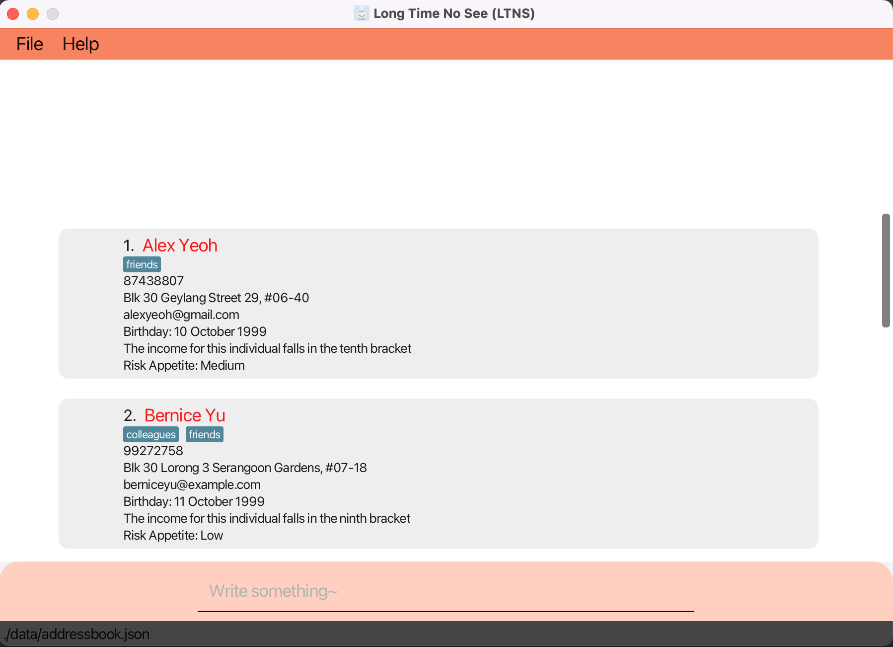

5. Not sure where to start? The following section is a detailed Tutorial on how to use the Application. Feel free to [skip](#features-overview) this section if you are confident in using the application.

--------------------------------------------------------------------------------------------------------------------

## Tutorial 

Welcome to the LTNS Tutorial! Here we will guide you through your journey of learning how to use your App!

LTNS works by giving your App commands through the keyboard. Let us first start by learning what's what. 

Before we begin, be sure to follow the [Quick Start](#quick-start) section above to install and run the Application.

The diagram below shows an example of how the Application looks like: 
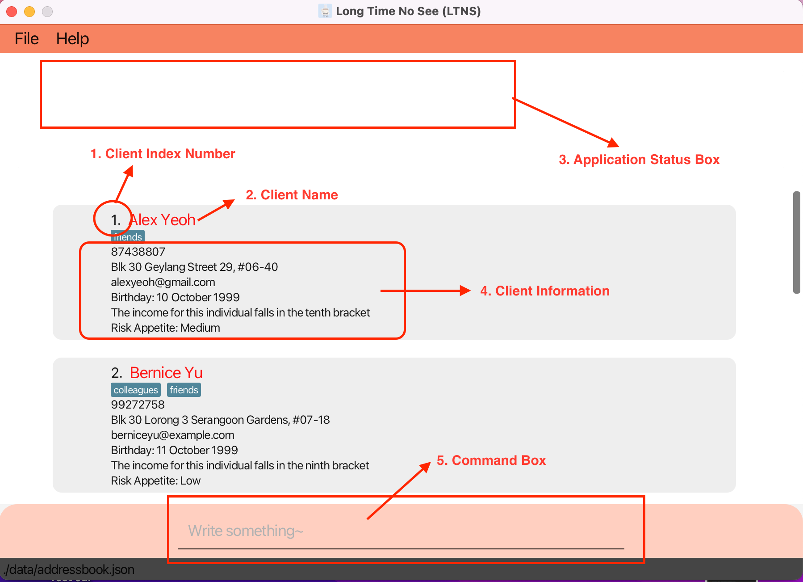
A description of the different parts of the Application is given below: 
1. **Client Index Number**: This represents the index number of a client, in commands that require `INDEX_NUMBER`, this will be the number to use 
2. **Client Name**: This is your client's name
3. **Application Status Box**: After entering commands, the Application will reply with status messages in this box eg. whether the command was successful or not
4. **Client Information**: Information related to your client will be displayed here, under the Client's _Index Number_ and _Name_
5. **Command Box**: Type your commands here

Now that you are familiar with your Application's layout, it's time to learn how to give it commands.

#### Learning to Use Commands 
As shown in the diagram above, the command box, also known as the [Command Line Interface (CLI)](#command-line-interface-cli) is where you will type your commands.

But what commands can you type? We will now learn how to understand the [Features](#features-overview) section below.

Each Feature section begins with an **Introduction**, followed by the **Command Format**. 

Each Command begins with a **Command Word**, followed by accompanying **Parameters**, if applicable. Parameters are additional information that the command needs to run. For example, if you want to add a Client, some parameters needed include a Client's name, contact number etc.

For example, when [Adding A Client](#adding-a-client--addclient), this is what you will see: 
Format: `addClient n/NAME p/PHONE_NUMBER e/EMAIL a/ADDRESS [t/TAG]…​ b/BIRTHDAY i/INCOME ra/RISK_APPETITE`

Let us understand how to read this. Firstly, `addClient` is the Command Word. This is followed by some Parameters, such as the `n/` parameter which represents a **Name**.

:bulb: **Tip:**
A Parameter wrapped in square brackets, such as `[t/TAG]` are optional Parameters! Parameters with ellipses behind such as `[t/TAG]...` indicate that there can be multiple parameters of the same type

An example of how we can use the `addClient` command is shown below: 
* **`addClient`**`n/John Doe p/98765432 e/johnd@example.com a/John street, block 123, #01-301 b/2000-01-01 i/90000.0 ra/M` 

:white_check_mark: **Give it a try!:**
Try typing the command above into the command box and hit `enter`. Now observe the changes! John Doe with his corresponding information should now be in your Application.

:bulb: **Tip:**
Notice that `[t/TAG]` are not required as they are optional. Also notice how we type the Parameter first before the client information eg. `b/2000-01-01` indicates a birthday on 1st January 2000

Given below are extra details regarding command formats:  

**:information_source: Notes about the command format:** 

* Words in `UPPER_CASE` are the [parameters](#parameter) by the user. 
  e.g. in `addClient n/NAME`, `NAME` is a parameter which can be used as `addClient n/John Doe`.

* Items in square brackets are optional. 
  e.g. `n/NAME [t/TAG]` can be used as `n/John Doe t/friend` or `n/John Doe`.

* Items with `…` after them can be used multiple times. 
  e.g. `[t/TAG]…​` can be used as `​` (i.e. 0 times). 
  and e.g. `c/cov…​` can be used 1 or more times.

* Parameters can be in any order. 
  e.g. if the command specifies `n/NAME p/PHONE_NUMBER`, `p/PHONE_NUMBER n/NAME` is also acceptable.

* If a parameter is expected once in the command, but has been specified multiple times, only the last occurrence of the parameter will be taken. 
  e.g. if you specify `p/12341234 p/56785678`, only `p/56785678` will be taken.

* Extraneous parameters for commands that do not take in parameters (such as `help`, `exit` and `clear`) will be ignored. 
  e.g. if the command specifies `help 123`, it will be interpreted as `help`.

* Click [here](#command-format-table) for a list of all possible parameters and their constraints

#### Command Practice 
In this section, we will guide you through entering basic commands. If you feel confident enough, feel free to [skip](#last-word-of-advice) this section. 

#### Last Word of Advice 
Congratulations! You are now ready to begin your journey of using LTNS! 

When you are ready, go to the [Feature](#features-overview) section to find out about the commands you can use. 

For ease of reading, each feature follows the following format:
1. Description
2. Command Format
3. Additional Pointers and Tips
4. Example Usages

You may also refer to the [Command Format Table](#command-format-table) to find detailed descriptions of each **command tags**. 

Additionally, refer to the [Command Summary Page](#command-summary) for a brief overview of every command.

Like all things, learning can take some time, but you'll soon realise that each Command is very intuitive! If you still find yourself confused, fret not! Feel free to [contact us](#contact-us). We will be more than happy to assist you.

--------------------------------------------------------------------------------------------------------------------

# Features Overview

**LTNS ** allows you to track your clients, policies and events.
As such, the features available to you are split into **4** main features:
1. [Common Features](#common-features): Here you can find basic Application features
2. [Client Features](#client-features): Here you can find all features related to keeping track of all your clients 
3. [Policy Features](#policy-features): Here you can find all features related to keeping track of all your policies 
4. [Event Features](#event-features): Here you can find all features related to keeping track of all your important appointments

--------------------------------------------------------------------------------------------------------------------

## Common Features

#### __________________________

### Viewing help : `help`

Help! I have no idea what's going on? When in doubt, just type `help` and help is on the way! Upon entering `help`, LTNS shows a message explaining how to access the help page.

Format: `help`

Example Usage: `help`

Example Result: Help message pop up appears

#### __________________________

### Clearing all entries : `clear`

Are you sure you want to do this? This clears all data from your application. 

:warning: **Warning:**
This action is irreversible! 

Format: `clear`

Example Usage: `clear`

Example Result: Clears all Application data.

#### __________________________

### Exiting the program : `exit`

Take a break! Financial advisors are people too! This exits the program.

Format: `exit`

Example Usage: `exit`

Example Result: Exits the app

#### __________________________

### Saving the data

Don't worry! LTNS application data is saved in the hard disk automatically after any command that changes the data. You don't have to do anything!

#### __________________________

### Editing the data file (For advance users)

Psst! Wondering if you can do more? You could edit the data files straight away to mass edit client data! But, with great power comes great responsibility, use it carefully!

LTNS application data is saved as a [JSON](#json-file) file `[JAR file location]/data/addressbook.json`. Advanced users are welcome to update data directly by editing that data file.

Below is an example of what your JSON File should look like: 
 

:exclamation: **Caution:**
If your changes to the data file makes its format invalid, LTNS will discard all data and start with an empty data file at the next run.

--------------------------------------------------------------------------------------------------------------------
## Client Features

Now let's embark on our journey! Like the dedicated financial advisor that you are, you will certainly want to keep track of your client information. Let's take a look at how we can do so.

#### __________________________

### Adding a client : `addClient`

Congratulations! You have just secured another client, LTNS lets you add a client, along with all their essential details, to have you keep track of them easily.

Format: `addClient n/NAME p/PHONE_NUMBER e/EMAIL a/ADDRESS [t/TAG]…​ b/BIRTHDAY i/INCOME ra/RISK_APPETITE`

This may seem like a lot of different information to manage, but not to worry, you can find a detailed list of the different input restrictions [here](#command-format-table).

:bulb: **Additional Tips:**  

- A client can have any number of tags (including 0) 
- The income added is based on an individual's Yearly income. 
- An income added is based on the **tax income brackets** set up by [IRAS for Financial Year 2022-2023.](https://www.iras.gov.sg/taxes/individual-income-tax/basics-of-individual-income-tax/tax-residency-and-tax-rates/individual-income-tax-rates) 
- More details on the tax income brackets can be found [here](#income-brackets)

Example Usage:
* `addClient n/John Doe p/98765432 e/johnd@example.com a/John street, block 123, #01-01, b/2000-05-05 i/5000.0 ra/L` adds John Doe into LTNS.
* `addClient n/Betsy Crowe t/friend e/betsycrowe@example.com a/Newgate Prison p/1234567 t/criminal b/1920-05-06 i/1000000 ra/H` adds Betsy Crowe into LTNS.

Let's try to add John Doe's details into LTNS. Simply enter the command `addClient n/John Doe p/98765432 e/johnd@example.com a/John street, block 123, #01-01, b/2000-05-05 i/5000.0 ra/L`

If successful, you should see the following message in the application status box

and you should now see John Doe's client information in LTNS

Having trouble? Fret not! Visit the [Frequently Asked Questions](#faq) to get some help

#### __________________________

### Switching to the view of currently listed clients : `clients`
 
After taking a look at your [policies](#switching-to-the-view-of-currently-listed-policies--policies) or [events](#switching-to-the-view-of-currently-listed-events--events), you may want to switch LTNS back to showing your clients. Well `clients` is the command for you, as it switches the display to show the current list of clients.

:bulb: **Tip:**
If you performed a search previously, `clients` maintains the same list of filtered clients. Alternatively if you wish to view the **full** list of clients, you may do so with the command [allClients](#listing-all-clients--allclients) 

Format: `clients`

Example Usage: `clients`

Example Result:
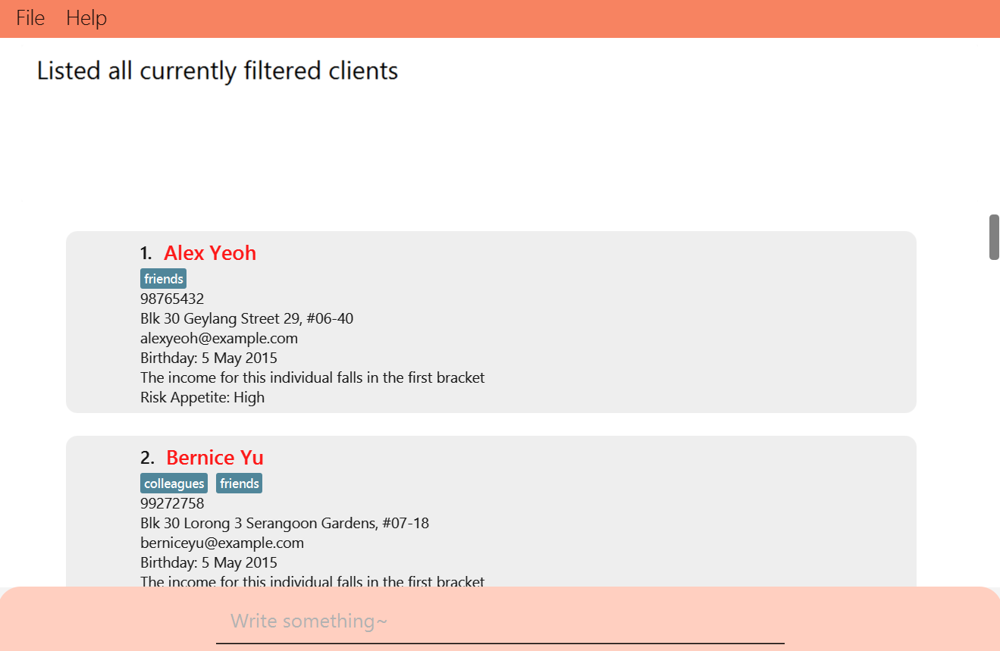

#### __________________________

### Listing all clients : `allClients`

Need to get an overview of all the clients you’ve stored? Simply type `allClients` to have all the clients stored be displayed, without any filtering.

Format: `allClients`

Example Usage: `allClients`

#### __________________________

### Editing a client : `editClient`

Oops! Seems like some of your clients changed their contact details. Not to worry, there is no need to delete their contact and add them again, LTNS allows you to edit an existing client's information.

Format: `editClient CLIENT_INDEX [n/NAME] [p/PHONE] [e/EMAIL] [a/ADDRESS] [t/TAG]… [b/BIRTHDAY] [i/INCOME] [ra/RISK_APPETITE] ​`

* Edits the client at the specified `CLIENT_INDEX`. The index refers to the index number shown in the displayed client list. The index **must be a positive integer** 1, 2, 3, …​
* At least one of the optional fields must be provided.
* Existing values will be updated to the input values.
* When editing tags, the existing tags of the client will be removed i.e adding of tags is not cumulative.
* You can remove all the client’s tags by typing `t/` without
    specifying any tags after it. 

Example Usage:
*  `editClient 1 p/91234567 e/johndoe@example.com` Edits the phone number and email address of the 1st client to be `91234567` and `johndoe@example.com` respectively.
*  `editClient 2 n/Betsy Crower t/` Edits the name of the 2nd client to be `Betsy Crower` and clears all existing tags.
*  `editClient 3 b/2000-01-01` Edits the birthday of the 3rd client to be the 1st January 2000.

Let's run through an example on editing your client information. Suppose LTNS already contains a client named Alex Yeoh, and he has just informed you that he changed his number to 98765432
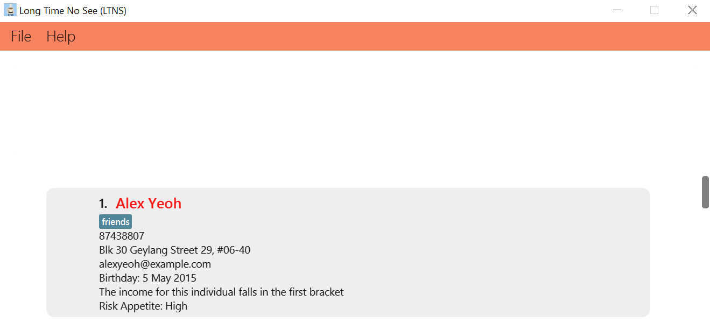

As he is currently first on the list, simply enter `editClient 1 p/98765432` and his client details should be immediately updated as shown
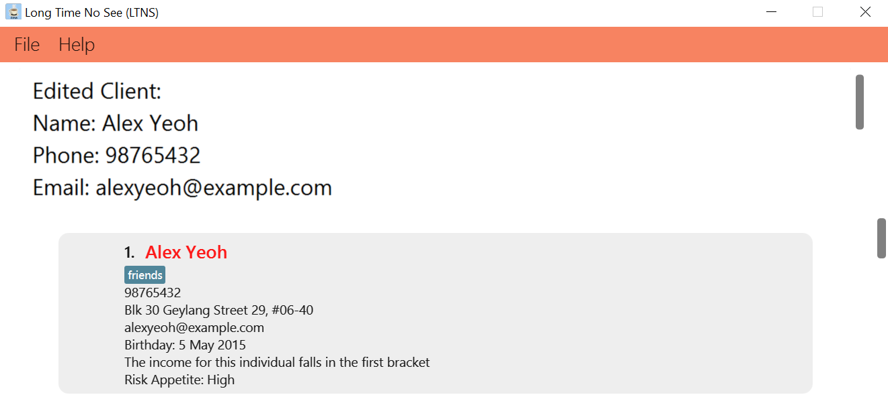

#### __________________________

### Searching for Clients : `findClient`

Seems like your career is advancing steadily, you now have a large number of clients you need to manage, and it is getting difficult to scroll and find clients. Fret not, you can easily search for clients based on certain [metrics](#metric)

:information_source: **Note:**
At least one metric has to be specified for the command to be valid

For a full list of the details of each metric and their search ranges, click [here](#findclient-detailed-specifications)!

Format: `findClient [n/NAME] [p/PHONE] [e/EMAIL] [a/ADDRESS] [t/TAG]…​ [b/BIRTHDAY] [i/INCOME] [ra/RISK_APPETITE] [ti/TITLE] [cov/COVERAGE]…​ [cmp/COMPANY_CODE]`

Example Usage:

* `findClient n/John` returns `john` and `John Doe`
* `findClient n/alex david` returns `Alex Yeoh`, `David Li`
* `findClient p/8743` returns clients with that contain `8743` in their phone number
* `findClient t/colleagues t/friends` returns clients with both the `colleagues` and `friends` tag
* `findClient n/alex t/friends` returns clients with the name `alex` and tagged with a `friends` tag

Let’s take a look at one example
- `findClient n/alex`

Here's the result

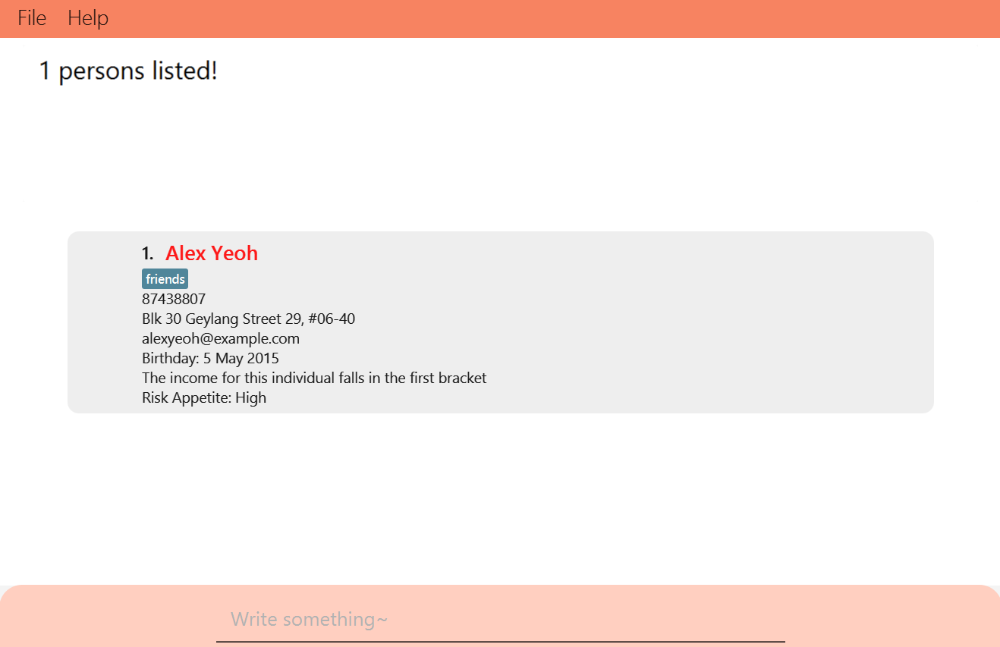

#### __________________________

### Deleting a client : `deleteClient`

Unfortunately it seems like you are no longer working with one of your clients, looks like we will have to delete their client details from LTNS.

Format: `deleteClient CLIENT_INDEX`

* Deletes the client at the specified `CLIENT_INDEX`.
* The index refers to the index number shown in the displayed client list.
* The index **must be a positive integer** 1, 2, 3, …​

Example Usage:
* `allClients` followed by `deleteClient 2` deletes the 2nd client in the LTNS.
* `findClient n/Betsy` followed by `deleteClient 1` deletes the 1st Client in the results of the `findClient` command.

#### __________________________

### Sorting all Clients : `sort`

With all the success you are having in your client acquisition, you are probably looking for a way to organise all these information that you have. LTNS allows you to sort all your client based on certain [metrics](#metric)

Click [here](#sorting-keywords) for a list of all the possible keywords

Format: `sort KEYWORD`

* Sorts the list of clients based on specified keyword
* Keyword must be from client details

Example Usage: 
* `sort name` will display your Client list view in alphabetical order based on their name
* `sort phone` will display your Client list view in numerical order based on their phone numbers

Below is an example of what you will expect to see when you call `sort email`:

#### __________________________

### Pin a Client: `pin`

Not all clients are equal, some are more important than others! How do you pay special attention to certain clients? `pin` allows you to do so by pinning them to a special list of clients.

* Format: `pin INDEX`  

Example Usage:
* `pin 1` pins the first client on list

To view these pinned clients, look [here](#viewing-pinned-clients-viewpin).

For example, let's try to pin Bernice's details in LTNS:

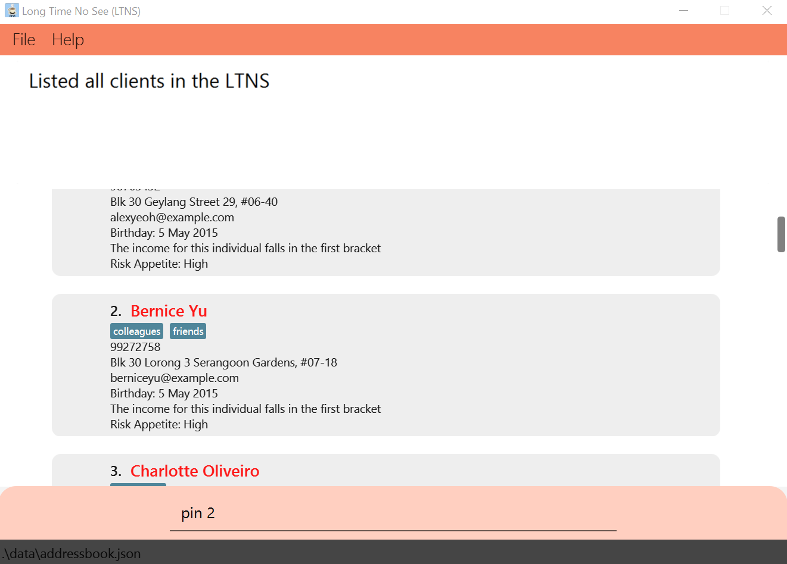

If successful, you should see the following success message:

#### __________________________

### Viewing Pinned Clients: `viewPin`

So, how exactly do I view these special clients? An extension of the pin function, the `viewPin` allows you to view all pinned clients at an instance!

* Format: `viewPin`  

Example Usage:
* `viewPin` opens up the list of pinned clients!

Remember pinning Bernice previously? Now you will be able to see Bernice's contact after entering `viewPin`:

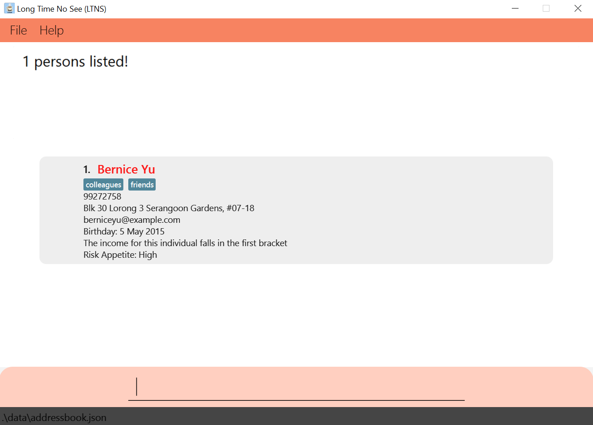

#### __________________________

### Assigning a Client to an Event/Policy 
An existing client in your Client list can be assigned to an Event or Policy. 
To find out how to do so, you can refer to the [Adding an Event](#adding-an-event-addevent) guide to assign a Client to an Event or refer to the [Assigning a Policy to a Client](#assigning-a-policy-to-a-client--assign) guide to find out how you can assign a Client to a Policy.

--------------------------------------------------------------------------------------------------------------------

## Policy Features

Policies are a financial advisor’s best friend. Whether it’s an insurance policy, or an investment linked policy, LTNS has got you “covered”! Store policies from all kinds of coverages and the top companies in Singapore and even to assign them to clients under your care when you secure a deal. Let’s take a look at how it all works!

#### __________________________

### Adding a Policy : `addPolicy`

Found a new policy you want to pitch to your clients? LTNS lets you add the policy alongside its company, coverage categories and commission levels, to easily access it in future.

Format: `addPolicy ti/TITLE cmp/COMPANY_CODE cms/Y1COMMISION% Y2COMISSION% Y3ONWARDS% cov/COVERAGE...`

The information here seems pretty intimidating at first but fret not, you can find detailed help on the different input restrictions [here](#command-format-table).

:bulb: **Additional Tips:**  

- What does your policy cover? A policy must have one or more coverages when created. Find the possible coverages and their corresponding codes [here](#valid-coverage-codes). 
- Which company does your policy belong to? Find out the valid companies and their corresponding codes [here](#valid-company-codes). 
- If you’d like to sell a policy from a company/with a coverage not in our list, write to us [here](#contact-us), and we’ll add it in if there are a significant number of requests! 
- Money is the name of the game! Enter the commissions agreed to with the provider in positive percentages from 0% to 100%! (e.g. 10% 3.5% 1.0%)

  

Example Usage:
* `addPolicy ti/PruShield cmp/PRU cms/10% 5% 1% cov/LIFE`
* `addPolicy ti/ManuInvest Duo cmp/MNF cms/6% 3% 1.5% cov/INVESTMENT cov/LIFE`

Let's try to add in the PruShield policy from above!

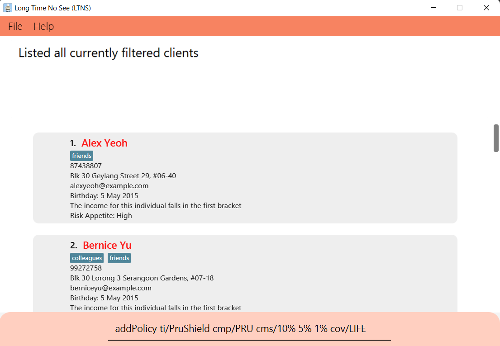

If successful, you should see the following success message:

#### __________________________

### Switching to the View of Currently Listed Policies : `policies`
After viewing your [clients](#client-features) or [events](#event-features), you may want to switch LTNS back to the view of your policies. 
Do it in an instant with the `policies` command!

:bulb: **Tip:**
If you performed a search previously, `policies` maintains the same list of filtered policies. Alternatively, if you wish to view the **full** list of clients, you may do so with the command [allPolicies](#listing-all-policies--allpolicies)

Format: `policies`

Example Usage: `policies`

Example Result: Shows the currently listed policies on the screen.

#### __________________________

### Listing All Policies: `allPolicies`
Need to get an overview of all the policies you’ve stored? Simply type `allPolicies` to have all the policies stored be displayed, without any filtering.

Format: `allPolicies`  
Example Usage: `allPolicies`  
Example Result: Shows all policies stored in LTNS, on the screen.

#### __________________________

### Deleting a Policy : `deletePolicy`
Changed your mind on a policy? Has a company decided to phase out a policy? Update that with the `deletePolicy` command. It lets you delete a policy at the specified `INDEX`. The index refers to the index number shown in the displayed list of policies. The index must be a positive integer 1, 2, 3, …

Format: `deletePolicy POLICY_INDEX`

Example Usage:
* `allPolicies` followed by `deletePolicy 2` deletes the 2nd policy in LTNS.
* `findPolicy ti/PruShield` followed by `deletePolicy 1` deletes the 1st policy in the results of the `findPolicy` command.

#### __________________________

### Searching for a Policy : `findPolicy`

You’re at a meeting, and your client wants to know what options they might have for a policy that covers their properties. Find it easily with based on certain [metrics](#metric).

Format: `findPolicy [ti/TITLE] [cov/COVERAGE]…​ [cmp/COMPANY_CODE]`

:information_source: **Note:**
At least one metric has to be specified for the command to be valid

For a full list of the details of each metric and their search ranges, click [here](#findpolicy-detailed-specifications)!

Example Usage:
* `findPolicy ti/Health plan` returns policies with the title `health plan` and `life plan`
* `findPolicy cov/LIFE cov/HEALTH` returns policies that cover both `LIFE` and `HEALTH`
* `findPolicy cmp/PRU` returns policies that belong to `Prudential Assurance Company`
* `findPolicy ti/Shield cov/LIFE` returns polices with `Shield` in its title and covers the `LIFE` coverage type

Let's look at an example:

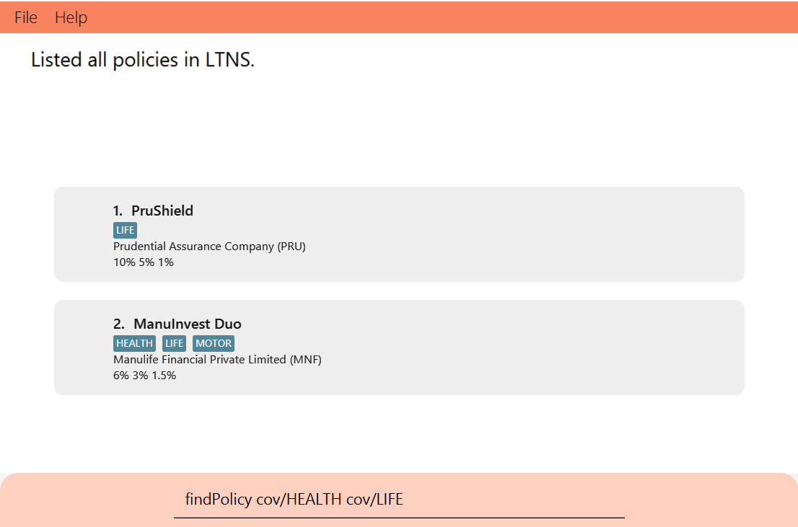

Here's the result:

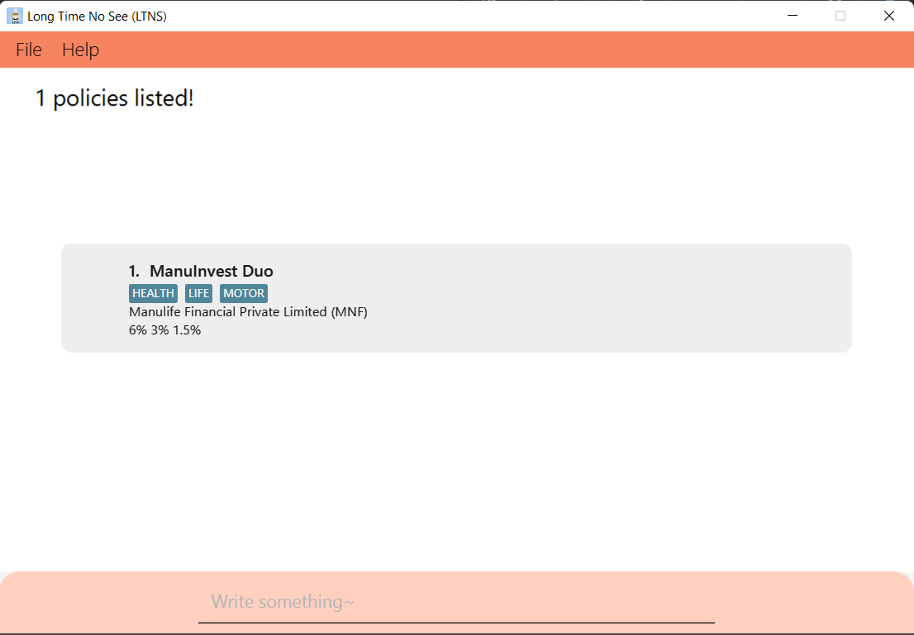

If not, not to worry, visit the [Frequently Asked Questions](#faq) to get some help.

#### __________________________

### Assigning a Policy to a Client : `assign` 

Congratulations! You’ve just sealed a deal with a client! Keep track of this by assigning the policy to your client in LTNS.

:information_source: **Note:**
If you have yet to add either your Client or Policy to the Application, you can refer to the [Adding a Client](#adding-a-client--addclient) or [Adding a Policy](#adding-a-policy--addpolicy) guides.

Format: `assign CLIENT_INDEX POLICY_INDEX pr/PREMIUM sd/STARTDATE ed/ENDDATE`

Find a detailed explanation of different input restrictions [here](#command-format-table).

:bulb: **Additional Tips:**  

- The start and end dates should be of the format "YYYY-MM-DD", and within the years 1900 - 2100.
 
- Premium should be any positive numeric value below `1000000000` with or without 2 decimal places.

Example Usage:

Assigning a policy can be quite complicated, so here’s a step-by-step example!

* Step 1: `findPolicy cmp/PRU` to filter the list of policies that belong to Prudential Assurance Company.
* Step 2: `findClient n/John Doe` to filter the list of clients to find 'John Doe'.
* Step 3: `assign 1 1 pr/2000 sd/2010-10-10 ed/2021-10-12` to assign the first policy in the list from Step 1, to the 
first client in the list from Step 2, with the following details:
  1. Yearly premium of $2000
  2. Start date of 10th October 2010
  3. End date of 12th October 2021

#### __________________________

### Listing Out Policies Assigned to a Client : `listAssigned`

Congrats on sealing deals with numerous clients! Need a quick reminder on the policies a client has taken up? 
This command lists out the policies that have been assigned to the client at the specified `INDEX`. 
The index refers to the index number shown in the displayed list of clients. The index must be a positive integer 1, 2, 3, ….
 

Format: `listAssigned CLIENT_INDEX`

Example Usage:

1. `findClient n/John Doe` to filter the list of clients to find `John Doe`.
2. `listAssigned 1` to list out the policies assigned to the first client in the list from Step 1.

#### __________________________

### Deleting Assigned Policies from a Client : `deleteAssigned`

It’s unfortunate, but it happens. If a client cancels their policy prematurely, reflect the deletion of their assigned policy in LTNS using this command. Specify the client’s index number in the displayed list of clients, and the corresponding assigned policies in their list of assigned policies. The indexes must be positive integers e.g. 1, 2, 3, …

Format: `deleteAssigned CLIENT_INDEX ASSIGNED_POLICY_INDEX`

Example Usage:
1. Similar to [listAssigned](#listing-out-policies-assigned-to-a-client--listassigned), filter the list for the desired client and find out which policies they have been assigned to.
2. `deleteAssigned 1 1` to delete the first assigned policy in the assigned policy list from Step 1, of the first client obtained from filtering the client list.

#### __________________________

### Tracking your Income  : `viewIncome`

Of course, as a financial advisor you would want to know your income! Automatically calculate your 3 year expected income (with selected year as starting year)

Format: `viewIncome YEAR`

:bulb: **Tip:**
Year chosen must be between 1900 and 2100

Example Usage:
* `viewIncome 2000` will display the expected income for years 2000, 2001 and 2002
* `viewIncome 1899` will not be allowed since 1899 is not between 1900 and 2200

Below is an example result of the command `viewIncome 2000`, which displays the three year expected income starting from year 2000.

--------------------------------------------------------------------------------------------------------------------

## Event Features

Having trouble keeping track of all your appointments amidst your busy schedule?

Fret not! Our handy app lets you track `Events` with clients! 

#### __________________________

### Adding an Event: `addEvent`
Made an appointment with a Client? Keep track of it by adding it to your Application! 

An `Event` consists of three primary indicators:

1. <B>Who</B>: The `name` of the client you are about to meet!
2. <B>What</B>: A short `description` of the event. This could be anything you'd like, from the location of the event, to some short meeting notes.
3. <B>When</B>: The `date` and `duration` of the event.

This function adds an `Event` into the address book

Format: `addEvent desc/EVENT_DESCRIPTION n/CLIENT_NAME date/EVENT_DATE st/START_TIME et/END_TIME`

For more details, find a detailed explanation of different input restrictions [here](#command-format-table).

For any event in LTNS, the client specified by your event should already be present in the app.

Let's ensure you have `Ben Leong` in your app before continuing on. Do refer to [Adding a Client](#adding-a-client--addclient) if you need a refresher

Now, let's add `Ben Leong`. In the command box, simply enter the `addClient` command as follows: 

`addClient p/98765432 n/Ben Leong e/dcsbenleong@example.com a/Com3 b/2000-01-01 i/90000.0 ra/M`

Not to worry about the specifics of Prof Ben, we just want to ensure a client named `Ben Leong` exists within the app. 

Now, we're ready to add the event proper.

* Example Usage: `addEvent desc/CS101 Consultation n/Ben Leong date/2023-01-01 st/12:00 et/13:00`
* Example Result: add an event with `Ben Leong` from `12:00` to `13:00` for the `1st January 2023` for a CS101 consultation.

If all's good, you should see the following command result at the top of your screen.

Having trouble? Not to worry! Just match the error message you've gotten with our helpful [Frequently Asked Questions](#faq) section.

#### __________________________

### Deleting an Event: `deleteEvent`
Oh my, you've keyed in an event wrongly! Well, it happens to the best of us...

Fret not! With LTNS, you can easily delete events by specifying its index.

It deletes the event at the specified `EVENT_INDEX`.

Format: `deleteEvent EVENT_INDEX`

The index refers to the index number shown in the displayed event list.
The index **must be a positive integer** 1, 2, 3, …​

* Example Usage: `deleteEvent 2`
* Example Result: deletes the 2nd event from the list.

#### __________________________

### Switching to the view of currently listed events : `events`
Hey, I'm on another page and I want a quick glance at my current events. How do I switch back and forth quickly?

This is the command for you!
If you previously filtered the event list ([via an Event Search](#searching-for-an-event--findevent)) and switched to view to other lists, this command will allow you to <B> come straight back to the filtered event list </B>

:bulb: **Tip:**
If you wish to view the **full** list of events, you may do so with the command `allEvents`. In fact, it's right next up! 

For a quick illustration, suppose I've previously searched for all events with `Ben Leong` [via an Event Search](#searching-for-an-event--findevent)

By doing the `events` command, I'm immediately brought back to my previously filtered event list.

Format: `events`

Example Usage: `events`

Here's the example result!

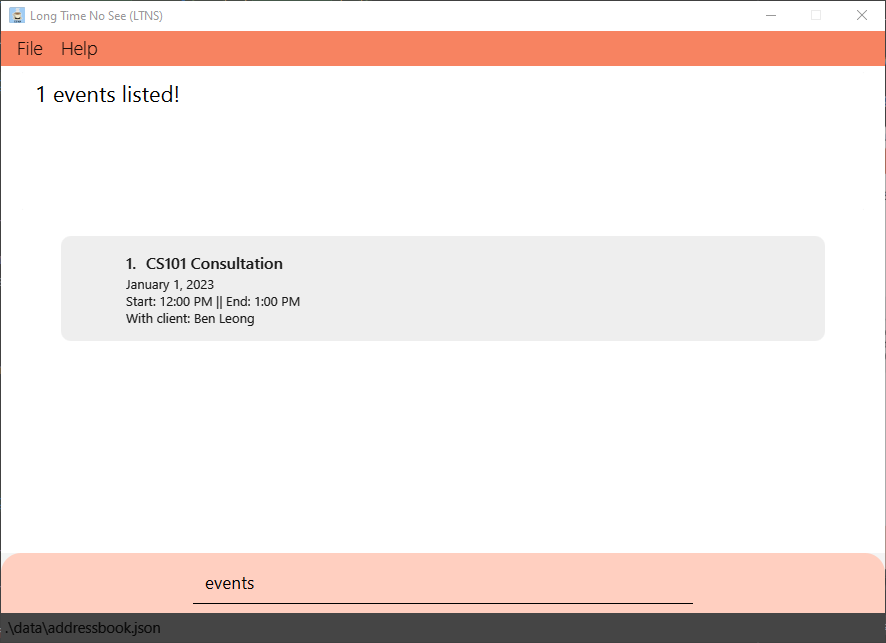
#### __________________________

### Viewing all Events : `allEvents`
Need to view every single event you've added? Well, look no further!

This command helps you to view all events you've added. The format is simply as follows

Format: `allEvents`  

Example Usage: `allEvents`  
Example Result: Lists all events added to the app, automatically sorted in chronological order.

Here's an example result
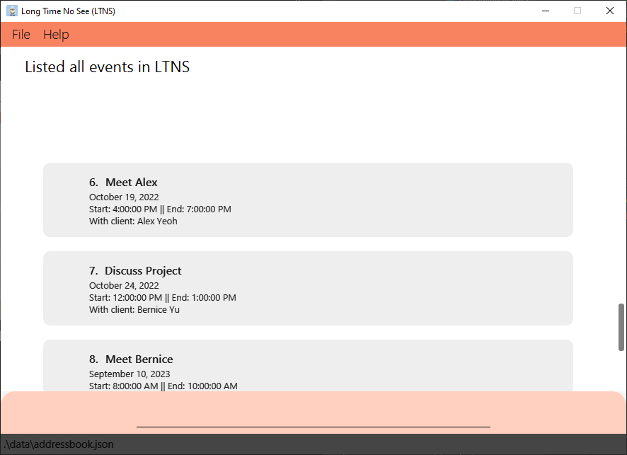

#### __________________________

### Searching for an Event : `findEvent`
So, you've added many events. Now, I just need to find that one event happening tomorrow... 

Easy! Just specify the appropriate [metrics](#metric), and LTNS will do the work for you. You can specify multiple metrics if you want your search to be more specific

:information_source: **Note:**
At least one metric has to be specified for the command to be valid

For a full list of the details of each metric and their search ranges, click [here!](#findevent-detailed-specifications) 

Format: `findEvent [desc/EVENT_DESCRIPTION] [n/NAME] [date/EVENT_DATE]`

Example Usage:

* `findEvent desc/coffee break meeting` returns events `morning coffee break meeting` and `afternoon coffee break meeting`
* `findEvent date/2022-12-30` returns all events which occurs on `30th December 2022`
* `findEvent n/Alice date/2022-11-15` returns all events for which participant name contains `Alice` and occurs on `15th November 2022`

Let's take a look at one example
* `findEvent n/Clement Tan date/2022-10-10` returns all events with `Clement Tan` on `10th October, 2022`.

Here's the result

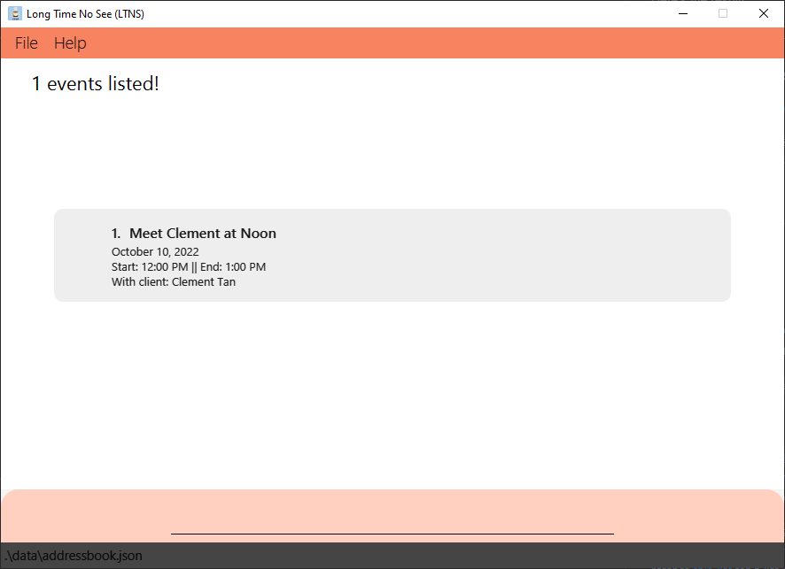

#### __________________________

### Viewing all Events in the next 7 days : `calendar`
One of the highlights of our app, the `calendar` function shows all events you have in the next 7 days

As usual, it's sorted in chronological order, for you to prioritize what's coming up soon.

Now, your immediate schedule is literally one word away.

Format: `calendar`

Sample Result:

Note that at the time of writing, the current date is `November 9, 2022`.

Hence, we display all events from `November 9, 2022 - November 16, 2022`.
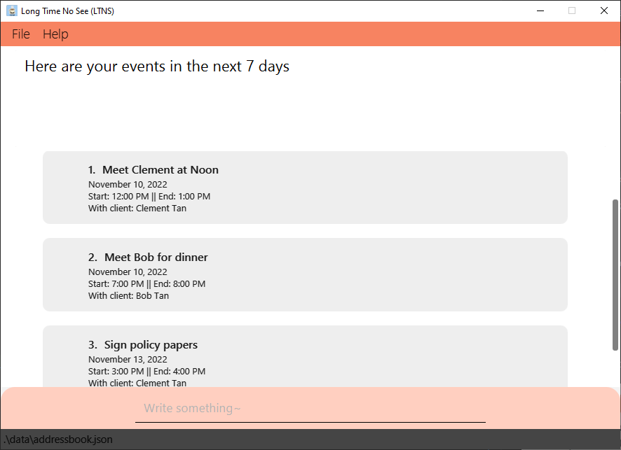

--------------------------------------------------------------------------------------------------------------------

## FAQ

Q: How do I transfer my data to another Computer?  
A : Install the app in the other computer and overwrite the empty data file it creates with the file that contains the data of your previous LTNS home folder.

Q: Why am I seeing `This client already exists in the address book` when trying to add a client? 
A: You probably already have a client with the same name in LTNS. You can try to add someone with a different name, or check out these sections to either [edit](#editing-a-client--editclient) their details or [delete](#deleting-a-client--deleteclient) their contact

Q: Why am I unable to edit my client details?
A: Do ensure that you are providing a valid `INDEX` to the command. `INDEX` should be a valid client index number that can be currently seen in the [Client View](#switching-to-the-view-of-currently-listed-clients--clients)

Q: Why am I seeing `The person you specified doesn't exist` when trying to add an event? 
A : When specifying the Client that you're meeting for this event, this Client must exist in your client list first.

Q: Why am I seeing `This Event overlaps with another event....` when trying to add an event?  
A: When adding an event, it's date and time cannot overlap with another event! But fret not, we've listed all overlapping events for your convenience, 
so you can view other events were causing the clash :) 

Q: Why am I seeing a `Sorting metric does not exist` when trying to sort my client list?  
A : You may be typing a wrong <b>keyword</b> or calling a sorting metric which is not supported. You may refer to [this list](#sorting-all-clients--sort) for a list of supported **keywords**. If you would like to suggest more sorting **keywords**, do feel free to [contact us](#contact-us)! 

Q: Why is a blank screen shown when I use the `calendar` feature?  
A: You may not have added any upcoming events in the next 7 days! You may want to [Add an Event](#adding-an-event-addevent) first. Alternatively, you can choose to [view all Events](#viewing-all-events--allevents) instead.

Q: What if a company whose policy I want to add is not available in the given list of company codes?  
A: Let us know which company you require by [contacting us](#contact-us). If we get enough requests, we might add yours in the next version!

Q: What if a coverage I want to add is not available in the list of coverages?  
A: Similarly, let us know which coverage you require by [contacting us](#contact-us). If we get enough requests, we might add yours in the next version!

Q: What do I do if the user guide does not address my concern?  
A: Fret not! Simply [reach out to us](#contact-us), and we will reply within three working days!

--------------------------------------------------------------------------------------------------------------------

## Command format table

| Parameter Name      | Prefix | Constraints                                                                                                                                                                                                                                                                                                                                                                                                                                                                                                                                                                                                                                                                                    |
|---------------------|--------|------------------------------------------------------------------------------------------------------------------------------------------------------------------------------------------------------------------------------------------------------------------------------------------------------------------------------------------------------------------------------------------------------------------------------------------------------------------------------------------------------------------------------------------------------------------------------------------------------------------------------------------------------------------------------------------------|
| Name                | n/     | - Only alphanumeric characters and spaces can be specified, and it should not be blank  - Only a maximum of 60 characters is allowed                                                                                                                                                                                                                                                                                                                                                                                                                                                                                                                                                       |
| Phone               | p/     | - Only numbers are allowed e.g `3.3` is not valid  - At least 3 numbers have to be specified  - Only a maximum of 25 digits is allowed                                                                                                                                                                                                                                                                                                                                                                                                                                                                                                                                             |
| Email               | e/     | <!--- Emails should be of the format `local-part@domain`  - The local-part should only contain alphanumeric characters and these special characters, excluding the parentheses, (+_.-)  - The local-part cannot start or end with any special characters  - The domain name is made up of domain labels separated by periods  - The domain name must end with a domain label at least 2 characters long, have each domain label start and end with alphanumeric characters and have each domain label consist of alphanumeric characters, separated only by hyphens, if any --> - Only valid emails are allowed  e.g `Alice` is not valid while `Alice@email.com` is valid |
| Address             | a/     | - Any length of textual input except for an empty space is valid                                                                                                                                                                                                                                                                                                                                                                                                                                                                                                                                                                                                                               |
| Tag                 | t/     | - Only single word, alphanumeric inputs are allowed                                                                                                                                                                                                                                                                                                                                                                                                                                                                                                                                                                                                                                            |
| Birthday            | b/     | - Only valid date inputs of the YYYY-MM-DD format are allowed. e.g `1990-12-30`  - Birthdays cannot be set in the future or before the 20th century (i.e 1900)                                                                                                                                                                                                                                                                                                                                                                                                                                                                                                                             |
| Income              | i/     | - Only positive decimal numbers are allowed                                                                                                                                                                                                                                                                                                                                                                                                                                                                                                                                                                                                                                                    |
| Risk Appetite       | ra/    | - Only one of the 3 levels, {H, M, L}, is allowed  - They represent the levels of High, Medium and Low respectively e.g `H` is valid while `High` is not valid                                                                                                                                                                                                                                                                                                                                                                                                                                                                                                                         |
| Title               | ti/    | - Only alphanumeric characters and spaces can be specified, and it should not be blank  - Only a maximum of 40 characters is allowed                                                                                                                                                                                                                                                                                                                                                                                                                                                                                                                                                       |
| Coverage            | cov/   | - Only inputs of the valid coverage type options are allowed                                                                                                                                                                                                                                                                                                                                                                                                                                                                                                                                                                                                                                   |
| Company Code        | cmp/   | - Only one of the valid company codes is allowed                                                                                                                                                                                                                                                                                                                                                                                                                                                                                                                                                                                                                                               |
| Commission          | cms/   | - Has to be in the format of (Y1COMMISSION)% (Y2COMMISSION)% (Y3ONWARDS)%, where the commission values and the brackets are to be replaced with numeric values between 0 and 100 inclusive, with up to 5 decimals.                                                                                                                                                                                                                                                                                                                                                                                                                                                                             |
| Premium             | pr/    | - Only positive numbers below 1000000000, with or without 2 decimal places are allowed                                                                                                                                                                                                                                                                                                                                                                                                                                                                                                                                                                                                         |
| Start date          | sd/    | - Only valid date inputs of the YYYY-MM-DD format are allowed. e.g `2020-12-30`  - Only dates that fall between the 20th and 21th century are allowed (i.e between the years 1900 and 2100)                                                                                                                                                                                                                                                                                                                                                                                                                                                                                                |
| End date            | ed/    | - Only valid date inputs of the YYYY-MM-DD format are allowed. e.g `2020-12-30`  - Only dates that fall between the 20th and 21th century are allowed (i.e between the years 1900 and 2100)   - One small note: The end date should come <B>after</B> start time! We haven't invented time travel as of the writing of this guide                                                                                                                                                                                                                                                                                                                                                      |
| Event Description   | desc/  | - Only alphanumeric characters and spaces can be specified, and it should not be blank  - Only a maximum of 175 characters is allowed                                                                                                                                                                                                                                                                                                                                                                                                                                                                                                                                                      |
| Event Date          | date/  | - Only valid date inputs of the YYYY-MM-DD format are allowed. e.g `2020-12-30`  - Only dates that fall between the 20th and 21th century are allowed (i.e between the years 1900 and 2100)                                                                                                                                                                                                                                                                                                                                                                                                                                                                                                |
| Start time          | st/    | - Only valid time inputs of the HH:mm format are allowed. e.g `23:59`                                                                                                                                                                                                                                                                                                                                                                                                                                                                                                                                                                                                                          |
| End time            | et/    | - Only valid time inputs of the HH:mm format are allowed. e.g `23:59`   - Should be later than the associated start time   -- One small note: Similar to adding dates, the end time must come after start time!                                                                                                                                                                                                                                                                                                                                                                                                                                                                        |

--------------------------------------------------------------------------------------------------------------------

## Command summary

What's a guide without a summary? Here you go! Everything you need, summarised into one section!

#### ______________________________________________________________________________

### General Commands

| Action                      | Format, Examples                                                                                                                                                                                              |
|-----------------------------|---------------------------------------------------------------------------------------------------------------------------------------------------------------------------------------------------------------|
| **Clear Pre-existing Data** | `clear`                                                                                                                                                                                                       |                                                                                                                                                                                                      
| **Help**                    | `help`                                                                                                                                                                                                        |
| **Exit Application**        | `exit`                                                                                                                                                                                                        |

#### ______________________________________________________________________________

### Commands For Clients

| Action                    | Format, Examples                                                                                                                                                                                                                                                    | Link back to Command Guide                                                              |
|---------------------------|---------------------------------------------------------------------------------------------------------------------------------------------------------------------------------------------------------------------------------------------------------------------|-----------------------------------------------------------------------------------------|
| **Find Client**           | `findClient [n/NAME] [p/PHONE] [e/EMAIL] [a/ADDRESS] [t/TAG]… [b/BIRTHDAY] [i/INCOME] [ra/RISK_APPETITE] [ti/TITLE] [cov/COVERAGE]…​ [cmp/COMPANY_CODE]`    e.g: `findClient n/Jim p/98765432`                                                                | [Searching for a Client](#searching-for-clients--findclient)                            |
| **Add Client**            | `addClient n/NAME p/PHONE_NUMBER e/EMAIL a/ADDRESS [t/TAG]... b/BIRTHDAY i/INCOME ra/RISK_APPETITE ​`     e.g: `addClient n/Clement Tan p/98765432 e/clementTan@example.com a/311, Clementi Ave 2, #02-25 t/friends t/owesMoney b/2019-05-05 i/10000.00 ra/M` | [Adding a Client](#adding-a-client--addclient)                                          |
| **Delete Client**         | `deleteClient (INDEX of CLIENT)`    e.g: `deleteClient 3`                                                                                                                                                                                                     | [Deleting a Client](#deleting-a-client--deleteclient)                                   |
| **Edit Client**           | `editClient (INDEX of CLIENT) [n/NAME] [p/PHONE_NUMBER] [e/EMAIL] [a/ADDRESS] [t/TAG]…​ [b/BIRTHDAY] [i/INCOME] [ra/RISK_APPETITE] `    e.g: `editClient 2 n/James Lee e/jameslee@example.com`                                                                | [Editing a Client](#editing-a-client--editclient)                                       |
| **View All Clients**      | `allClients`                                                                                                                                                                                                                                                        | [Listing all Clients](#listing-all-clients--allclients)                                 |
| **View Filtered Clients** | `clients`                                                                                                                                                                                                                                                           | [Switching to Client View](#switching-to-the-view-of-currently-listed-clients--clients) |                                                         
| **Sort Clients**          | `sort SORTING_METRIC`  eg. `sort name`                                                                                                                                                                                                                           | [Sorting all Clients](#sorting-all-clients--sort)                                       |
| **Pin**                   | `pin (INDEX of CLIENT)`    e.g: `pin 1`                                                                                                                                                                                                                       | [Pin a Client](#pin-a-client-pin)                                                       |
| **View Pinned**           | `viewPin`                                                                                                                                                                                                                                                           | [Viewing Pinned Clients](#viewing-pinned-clients-viewpin)                               |

Note: `allClients` shows all existing clients inside LTNS, while `clients` show all clients based on filter metric placed previously.

#### ______________________________________________________________________________

#### Income brackets

| Income Bracket | Yearly Income range                                 |
|----------------|-----------------------------------------------------|
| First          | Less than or equal to S$30,000                      |
| Second         | More than S$30,000, less than or equal to $40,000   |
| Third          | More than S$40,000, less than or equal to $80,000   |
| Fourth         | More than S$80,000, less than or equal to $120,000  |
| Fifth          | More than S$120,000, less than or equal to $160,000 |
| Sixth          | More than S$160,000, less than or equal to $200,000 |
| Seventh        | More than S$200,000, less than or equal to $240,000 |
| Eight          | More than S$240,000, less than or equal to $280,000 |
| Ninth          | More than S$280,000, less than or equal to $320,000 |
| Tenth          | More than $320,000                                  |

#### ______________________________________________________________________________

#### FindClient Detailed Specifications

| Metric        | Prefix | Search range                                                                                                                                                                                                                                                                                                                                              |
|---------------|--------|-----------------------------------------------------------------------------------------------------------------------------------------------------------------------------------------------------------------------------------------------------------------------------------------------------------------------------------------------------------|
| Name          | n/     | - The search is case-insensitive. e.g `hans` will match `Hans`  - The order of the keywords does not matter. e.g. `Hans Bo` will match `Bo Hans`  - Only full words will be matched e.g. `Han` will not match `Hans`  - clients matching at least one keyword will be listed.   e.g. `Hans Bo` will return `Hans Gruber`, `Bo Yang`       |
| Phone         | p/     | - All clients whose phone number contains the exact specified numbers will be listed                                                                                                                                                                                                                                                                      |
| Email         | e/     | - The search is case-insensitive. e.g `alice@example.com` will match `Alice@example.com`   - All clients whose email matches the input will be listed                                                                                                                                                                                                 |
| Address       | a/     | - The search is case-insensitive. e.g `Bedok` will match `bedok`  - All clients whose address contains the input will be listed                                                                                                                                                                                                                       |
| Tag           | t/     | - The search is case-insensitive. e.g `friends` will match `Friends`  - Only full words will be matched e.g. `colleagues` will not match `colleague`  - More than one tag can be specified to list all clients that have all the specified tags.   e.g. `friends` and `family` will list all clients with both the `friends` and `family` tag |
| Birthday      | b/     | - Only clients whose birthday falls on the specified date will be listed                                                                                                                                                                                                                                                                                  |
| Income        | i/     | - Any valid income value can be entered and it will be matched with the corresponding income bracket  - All clients whose income falls under the same income bracket as the specified income will be listed   e.g `15000` will be matched with `12000`                                                                                            |
| Risk Appetite | ra/    | - All clients whose risk appetite matches the specified risk level will be listed                                                                                                                                                                                                                                                                         |
| Title         | ti/    | - The search is case insensitive. e.g `Health Plan` will match `health plan`  - Clients who are covered by a policy of which title contains at least one keyword will be listed                                                                                                                                                                       |
| Coverage      | cov/   | - More than one coverage can be specified to list all clients with all of the specified coverage types.   e.g. `HEALTH` and `LIFE` will list all clients with both the `HEALTH` and `LIFE` coverage type   - Clients who are covered by policies which covers all the specified coverage types will be listed                                     |
| Company Code  | cmp/   | - Clients who are covered by a policy belonging to the specified company will be listed                                                                                                                                                                                                                                                                   |

**Note:** `Title`, `Coverage` and `Company Code` refer to the details of policies assigned to the client. More details can be found in the [Policies](#policy-features) section

Ready to try some examples? Navigate back to the `findClient` command section [here](#searching-for-clients--findclient)!

#### ______________________________________________________________________________

#### Sorting keywords

| KEYWORD          | Function                                                                                                             |
|:-----------------|:---------------------------------------------------------------------------------------------------------------------|
| `default`        | Based on when a client was added, from oldest to newest                                                              |
| `name`           | By alphabetical order ie. "a" to "z"                                                                                 |
| `email`          | Clients using the same email platform are grouped together, thereafter, alphabetical order is used within each group |
| `phone`          | By numerical order of the phone number                                                                               |
| `birthday`       | From oldest to youngest                                                                                              |                                                                                             
| `income`         | From lowest to highest income                                                                                        |
| `risk appetite`  | From lowest to highest ie. "L" to "M" to "H"                                                                         |

:warning: **Warning:**
If your client's name contains numbers, sorting by name might behave incorrectly!

Ready to try some examples? Navigate back to the `sort` command section [here](#sorting-all-clients--sort)!

#### ______________________________________________________________________________

### Commands For Policy

| Action                     | Format, Examples                                                                                                                                              |                                                                                                       |
|----------------------------|---------------------------------------------------------------------------------------------------------------------------------------------------------------|-------------------------------------------------------------------------------------------------------|
| **Find Policy**            | `findPolicy [ti/TITLE] [cov/COVERAGE]…​ [cmp/COMPANY_CODE]`     e.g: `findPolicy cov/LIFE`                                                             | [Searching for a Policy](#searching-for-a-policy--findpolicy)                                         |        
| **Add Policy**             | `addPolicy ti/POLICY_TITLE cmp/POLICY_COMPANY cms/POLICY_COMMISSION cov/POLICY_COVERAGE...`    e.g: `addPolicy ti/Health cmp/MNF cms/4% 3% 2% cov/LIFE` | [Adding a Policy](#adding-a-policy--addpolicy)                                                        |                                                                                                                         
| **Delete Policy**          | `deletePolicy (INDEX of POLICY)`     e.g: `deletePolicy 1`                                                                                              | [Deleting a Policy](#deleting-a-policy--deletepolicy)                                                 |                                                                                                                                                                                             
| **View All Policies**      | `allPolicies`                                                                                                                                                 | [Listing all policies](#listing-all-policies-allpolicies)                                             |
| **View Filtered Policies** | `policies`                                                                                                                                                    | [Switching to Policy View](#switching-to-the-view-of-currently-listed-policies--policies)             |
| **Assign Policies**        | `assign (INDEX of CLIENT) (INDEX of POLICY) pr/PREMIUM_PAID sd/START_DATE ed/END_DATE`     e.g: `assign 1 1 pr/10000 sd/2000-01-02 ed/2000-02-01`       | [Assigning a Policy to a Client](#assigning-a-policy-to-a-client--assign)                             |
| **Delete Assigned**        | `deleteAssigned (INDEX of CLIENT) (INDEX of POLICY)`    e.g: `deleteAssigned 1 1`                                                                       | [Deleting Assigned Policies from a Client](#deleting-assigned-policies-from-a-client--deleteassigned) |                                                                                                                                                                                                               
| **List Assigned**          | `listAssigned (INDEX of CLIENT) `     e.g: `listAssigned 1`                                                                                             | [Listing all Assigned Policies](#listing-out-policies-assigned-to-a-client--listassigned)             |
| **View Income**            | `viewIncome YEAR`    e.g: `viewIncome 2000`                                                                                                             | [Tracking your Income](#tracking-your-income---viewincome)                                            |                                                                                                                                                                                                                                                                                                                                                                           

Note: `allPolicies` shows all existing policies inside LTNS, while `policies` show all policies based on filter metric placed previously.

#### ______________________________________________________________________________

#### Valid Coverage codes

| Coverage Code | Coverage Name        |
|---------------|----------------------|
| LIFE          | Life Insurance       |
| MOTOR         | Motor Insurance      |
| HEALTH        | Health Insurance     |
| TRAVEL        | Travel Insurance     |
| PROPERTY      | Property Insurance   |
| MOBILE        | Mobile Insurance     |
| BITE          | Bite-sized Insurance |
| INVESTMENT    | Investment based     |

Ready to try some examples? Navigate back to the `addPolicy` command section [here](#adding-a-policy--addpolicy)!

#### ______________________________________________________________________________

#### Valid Company codes

| Company Code | Company Name                       |
|--------------|------------------------------------|
| MNF          | Manulife Financial Private Limited |
| PRU          | Prudential Assurance Company       |
| AXA          | AXA Insurance Private Limited      |
| GEL          | Great Eastern Life                 |
| NTU          | NTUC Income Insurance              |
| ETQ          | Etiqa Insurance                    |
| TML          | Tokio Marine Life Insurance        |
| AIA          | AIA Singapore Private Limited      |
| AVI          | Aviva Limited                      |
| FWD          | FWD Singapore Private Limited      |

Ready to try some examples? Navigate back to the `addPolicy` command section [here](#adding-a-policy--addpolicy)!

#### ______________________________________________________________________________

#### FindPolicy Detailed Specifications

The following table illustrates the details of each metric and their search range:

| Metric       | Prefix | Search range                                                                                                                                                                                                                                                                                |
|--------------|--------|---------------------------------------------------------------------------------------------------------------------------------------------------------------------------------------------------------------------------------------------------------------------------------------------|
| Title        | ti/    | - The search is case insensitive. e.g `Health Plan` will match `health plan`  - Policies which titles contains at least one keyword will be listed                                                                                                                                      |
| Coverage     | cov/   | - More than one coverage can be specified to list all policies with all of the specified coverage types.   e.g. `HEALTH` and `LIFE` will list all policies with both the `HEALTH` and `LIFE` coverage type   - Policies which cover all the specified coverage types will be listed |
| Company Code | cmp/   | - Policies which belong to the specified company will be listed                                                                                                                                                                                                                             |

Ready to try some examples? Navigate back to the `findPolicy` command section [here](#searching-for-a-policy--findpolicy)!

#### ______________________________________________________________________________

### Commands For Events

| Action                   | Format, Examples                                                                                                                                                                       | Link back to Command Guide                                                                |
|--------------------------|----------------------------------------------------------------------------------------------------------------------------------------------------------------------------------------|-------------------------------------------------------------------------------------------|
| **Find Event**           | `findEvent [desc/EVENT_DESCRIPTION] [n/NAME] [date/EVENT_DATE]`    e.g: `findEvent date/2022-05-05`                                                                             | [Searching for an Event](#searching-for-an-event--findevent)                              |
| **Add Event**            | `addEvent desc/EVENT_DESCRIPTION n/NAME date/EVENT_DATE st/START_TIME et/END_TIME`     e.g: `addEvent desc/Meet Clement at Noon n/Clement Tan date/2022-10-10 st/12:00 et/13:00` | [Adding an Event](#adding-an-event-addevent)                                              |
| **Delete Event**         | `deleteEvent (INDEX of EVENT)`     e.g: `deleteEvent 1`                                                                                                                          | [Deleting an Event](#deleting-an-event-deleteevent)                                       |
| **View All Events**      | `allEvents`                                                                                                                                                                            | [Listing all Events](#viewing-all-events--allevents)                                      |
| **View Filtered Events** | `events`                                                                                                                                                                               | [Switching to Event View](#switching-to-the-view-of-currently-listed-events--events)      |
| **View Calendar**        | `calendar`                                                                                                                                                                             | [Viewing all Events in the next 7 days](#viewing-all-events-in-the-next-7-days--calendar) |

Note: `allEvents` shows all existing events inside LTNS, while `events` show all events based on filter metric placed previously.

#### ______________________________________________________________________________

#### FindEvent Detailed Specifications

The following table illustrates the details of each metric and their search range:

| findEvent Metrics                                                          | Prefix | Search range                                                                                                                                                                                                                                                                                                                                                                                            |
|----------------------------------------------------------------------------|--------|---------------------------------------------------------------------------------------------------------------------------------------------------------------------------------------------------------------------------------------------------------------------------------------------------------------------------------------------------------------------------------------------------------|
| Event Description                                                          | desc/  | - The search is case-insensitive. e.g `Meeting to discuss plans` will match `meeting to discuss plans`  - Only full phrases will be matched e.g. `Meeting to discuss plans` will not match `Plans`  - Only events for which description contains the complete specified phrase will be listed.   e.g. `discuss plans` will return `Meeting to discuss plans` and `Discuss plans`            |
| Name   Note: Name here refers to the name of the event participant | n/     | - The search is case-insensitive. e.g `John` will match `john`  - The order of the keywords does not matter. e.g. `Hans Bo` will match `Bo Hans`  - Only full words will be matched e.g. `Han` will not match `Hans`  - Events with the participant name containing at least one keyword will be listed.   e.g. `Hans Bo` will return events which involve `Hans Gruber` or `Bo Yang`   |
| Event Date                                                                 | date/  | - Only events which occur on the specified date will be listed                                                                                                                                                                                                                                                                                                                                          |

Ready to try some examples? Navigate back to FindEvent command section [here](#searching-for-an-event--findevent)!

#### Additional Notes:
* For better clarity, `INDEX` has been placed in parentheses to denote clearly which index is being referred to (either CLIENT, POLICY or EVENT). At the same time, it is compulsory to include `INDEX`.
    E.g: `(INDEX of EVENT)` refers to index from a list of events.

--------------------------------------------------------------------------------------------------------------------

## Glossary 

#### Parameter
Parameters refer to the information you type into the app to be stored. For example, `n/John` where John is the parameter.

#### Policy
An insurance or investment package entailing the details of the insurance and/or investment.

#### Coverage 
Specific to an insurance policy, coverage describes the amount of risk or liability which is covered by the insurance policy.

#### Graphic User Interface (GUI)
A User Interface that allows users to interact with the application through visual components.

#### Command-Line Interface (CLI)
A Text-Based User Interface which allows you to use the application in the form of typing out "commands".

#### JSON File 
A file which is used to store data in text form. 

#### Metric 
A standard of measurement. In the case of LTNS, a metric in sorting or searching tells the application how to compare the clients.

#### Income Bracket
Various income level ranges categorised by levels. LTNS uses the Inland Revenue Authority of Singapore's (IRAS) measurement of an income bracket.

--------------------------------------------------------------------------------------------------------------------

## Contact Us 
You may contact us at the following email: `e0725346@u.nus.edu`

     
 
 
